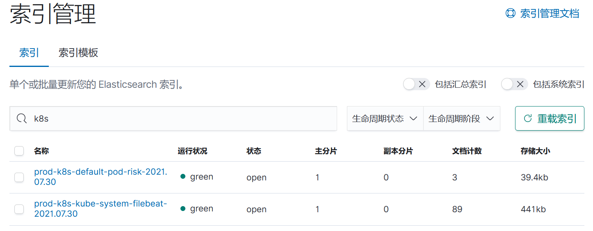

***filebeat collect k8s logs***



```yaml
---
apiVersion: rbac.authorization.k8s.io/v1
kind: ClusterRole
metadata:
  name: filebeat
  labels:
    app: filebeat
rules:
- apiGroups: [""]
  resources:
  - namespaces
  - pods
  - nodes
  verbs:
  - get
  - watch
  - list

---
apiVersion: v1
kind: ServiceAccount
metadata:
  namespace: kube-system
  name: filebeat
  labels:
    app: filebeat

---
apiVersion: rbac.authorization.k8s.io/v1
kind: ClusterRoleBinding
metadata:
  name: filebeat
subjects:
- kind: ServiceAccount
  name: filebeat
  namespace: kube-system
roleRef:
  kind: ClusterRole
  name: filebeat
  apiGroup: rbac.authorization.k8s.io

---

apiVersion: v1
kind: ConfigMap
metadata:
  name: filebeat-config
  namespace: kube-system
  labels:
    k8s-app: filebeat
data:
  filebeat.yml: |-
    filebeat.inputs:
      - type: container
        paths:
          - /var/lib/docker/containers/*/*.log
        processors:
        - add_kubernetes_metadata:
            host: ${NODE_NAME}
            matchers:
            - logs_path:
                logs_path: "/var/lib/docker/containers/"
        #symlinks: true
        #exclude_lines: [".+? INFO[^*].+", ".+? DEBUG[^*].+","Non-zero metrics in the last","Closing because close_inactive of"]
        fields:
          service: "prod-k8s-log"
          nodename: ${NODE_NAME}
        encoding: utf-8
        #scan_frequency: 10s
        #json.keys_under_root: true
        #json.add_error_key: true
        #json.overwrite_keys: true
        #json.message_key: log
        #multiline:
        #  pattern: ^\[?\d{2}
        #  negate: true
        #  match: after
        #  max_lines: 1000

    output.logstash:
      hosts: ["10.133.30.180:5044"]
    
    processors:
      - add_host_metadata: ~
      - add_kubernetes_metadata:
          default_indexers.enabled: true
          default_matchers.enabled: true
    
    logging.selectors: ["*"]

---

apiVersion: v1
kind: ConfigMap
metadata:
  namespace: kube-system
  name: filebeat-indice-lifecycle
  labels:
    app: filebeat
data:
  indice-lifecycle.json: |-
    {
      "policy": {
        "phases": {
          "hot": {
            "actions": {
              "rollover": {
                "max_size": "5GB" ,
                "max_age": "1d"
              }
            }
          },
          "delete": {
            "min_age": "30d",
            "actions": {
              "delete": {}
            }
          }
        }
      }
    }

---

apiVersion: apps/v1
kind: DaemonSet
metadata:
  namespace: kube-system
  name: filebeat
  labels:
    app: filebeat
spec:
  selector:
    matchLabels:
      app: filebeat
  template:
    metadata:
      labels:
        app: filebeat
    spec:
      serviceAccountName: filebeat
      terminationGracePeriodSeconds: 30
      containers:
      - name: filebeat
        image: docker.elastic.co/beats/filebeat:7.13.4
        args: [
          "-c", "/etc/filebeat.yml",
          "-e",
        ]
        env:
        - name: NODE_NAME
          valueFrom:
            fieldRef:
              fieldPath: spec.nodeName

        securityContext:
          runAsUser: 0

        resources:
          limits:
            memory: 200Mi
          requests:
            cpu: 100m
            memory: 100Mi

        volumeMounts:
        - name: config
          mountPath: /etc/filebeat.yml
          readOnly: true
          subPath: filebeat.yml

        - name: filebeat-indice-lifecycle
          mountPath: /etc/indice-lifecycle.json
          readOnly: true
          subPath: indice-lifecycle.json

        - name: data
          mountPath: /usr/share/filebeat/data

        - name: varlog
          mountPath: /var/log
          readOnly: true

        - name: varlibdockercontainers
          mountPath: /var/lib/docker/containers
          readOnly: true

        - name: dockersock
          mountPath: /var/run/docker.sock

      volumes:
      - name: config
        configMap:
          defaultMode: 0600
          name: filebeat-config

      - name: filebeat-indice-lifecycle
        configMap:
          defaultMode: 0600
          name: filebeat-indice-lifecycle

      - name: varlog
        hostPath:
          path: /var/log

      - name: varlibdockercontainers
        hostPath:
          path: /var/lib/docker/containers

      - name: dockersock
        hostPath:
          path: /var/run/docker.sock

      - name: data
        hostPath:
          path: /var/lib/filebeat-data
          type: DirectoryOrCreate
```
