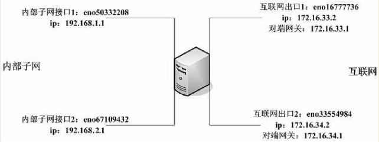

```
.内核版本
3.14.9
3  内核主版本
14 偶数表示稳定版本，奇数表示开发中版本
9  修改的数

.swap
swap分区没有挂载点
大小通常为内存的2倍
当物理内存不足时，系统会将内存中不常用的数据放到SWAP中，即SWAP此时被当作了虚拟内存

.NetInstall源
http://mirrors.163.com/centos7/os/x86_64/

.启动级别
0 关机
1 单用户模式
3 完整的多用户模式
5 图形桌面
6 重新启动

.TCP/IP
1) 网络接口层  物理层／数据链路层 :
    接口＋链路控制
2) 网际互联层  网络层             :
    主机到主机间的通信, IP/ARP/RARP/ICMP
3) 传输层      传输层:
    为应用层提供端到端的通信功能
    提供流量控制、确保数据完整、正确
    TCP
    UDP
4) 应用层      会话层／表示层／应用层

5) 包
   TCP／IP 称为 帧
   IP层    称为 IP数据报
   TCP层   称为 TCP报文

6)
   版本      1   0－0
   长度      4   1-4
   服务类型  8   5－12
   总长度        16-31

.ping
 -f 极限检测，快速大量给目标主机发包
 -R 记录路由过程
 -c 只发指定的包数
 -i 间隔几秒发一包
 -I 使用指定的网络界面发送数据包
 -t 设置存活数据TTL的大小

.ifconfig
 ifconfig en0 192.168.0.100/24 up

.route
 route -n
 route add -net 192.168.1.0 netmask 255.255.255.0 gw 192.168.0.1
 route del -net 192.168.1.0 netmask 255.255.255.0
 route add default gw 192.168.0.1

.rsync
 -c 对文件传输进行校验
 -a 归档模式，以递归方式传输文件，并保持文件属性，等于-rlptgoD
 -r 递归模式
 -R 使用相对路径
 -p 保持文件权限
 -o 保持文件属主
 -g 保持文件属组
 -t 保持文件时间信息
 -n 现实哪些文件将被传输
 -W 复制文件，不进行增量检测
 -e 使用rsh、ssh方式进行数据同步
 --delete  删除DST中SRC没有的文件
 -z 传输时压缩
 --exclude=PATTERN  排除文件模式
 --include=PATTERN  需要传输的文件模式
 --exclude-from=FILE    不传输FILE内的文件
 --include-from=FILE    传输的FILE内的文件
 --progress             在传输时显示传输过程
 --port 56789

 rsync -avz --port 56789 a.txt root@a.com::backup/tmp/a.txt

.netstat 
 -r 显示路由表

.traceroute
 -i 指定网卡
 -I 使用ICMP回应取代UDP
 -n 使用IP地址，而非主机名
 -p 设置UDP端口
 -r 忽略路由表，直接发包到远程主机
 -s 设置本地主机送出数据包的IP地址

.wget
 -nc 不覆盖现有文件
 -c  断点续传
 -N  只下载更新的文件

.iptables
1) table
   nat:
     PREROUTING
     POSTROUTING

   mangle（应用可在此规则表里设定，如数据包做标记）
      PREROUTING
      FORWARD
      POSTROUTING

   filter: 是默认规则表
     chain:
      INPUT
      FORWARD
      OUTPUT
    动作:
      ACCEPT
      DROP
      REJECT
      LOG

0) SNAT 源地址转换
   DNAT 目的地址转换

echo 1 > /proc/sys/net/ipv4/ip_forward
iptables -t filter -A FORWARD -s 192.168.19.0/24 -j DROP
入包:
包--> eth0-->
 mangle PREROUTING (对包进行改写或做标记) -->
 nat PREROUTING (主要做DNAT) -->
 路由判断 (包是发往本地还是用来转发的) -->
 mangle INPUT (路由后，被送往本地程序前对包进行改写或做标记) -->
 filter INPUT (以本地为目的的包都要经过此链) -->
 本地服务程序


.出包
程序 -->
  路由判断 -->
  mangle OUTPUT (对包进行改写或做标记) -->
  nat OUTPUT (对发出的包进行DNAT操作) -->
  filter OUTPUT (对本地发出的包过滤) -->
  mangle POSTROUTING (进行包修改) -->
  filter POSTROUTING (做SNAT) -->
  离开网口

.转发的包
数据包在链路上传输 -->
进入网络接口 -->
mangle PREROUTING (对包进行改写或做标记) -->
nat PREROUTING (做DNAT) -->
路由判断(发往本地还是转发) -->
mangle FORWARD (特殊情况才会被用到,在最初的路由判断后，在最后一次更改包的目的之前) -->
filter FORWARD (所有要转发的包都会经过这里,针对包的过滤也在这里进行) -->
mangle POSTROUTING (在所有更改包的目的地址的操作完成之后做的，但这时包还在本地) -->
nat POSTROUTING (此链用来做SNAT,不推荐在此做过滤,因为某些包即使不满足条件也会通过) -->
离开网络接口


-F 删除规则链的所有规则
-Z 将数据包计数器归零
-N 定义新的规则链
-X 删除某个规则链
-P 默认处理方式

--sport  匹配包的源端口
--dport  匹配包的目的端口
--tcp-flags 匹配数据包的状态标志,SYN/ACK/FIN/ALL/NONE
-m 匹配不连续的多个源端口或目的端口

REDIRECT  将数据包定向另一个端口
LOG       将数据包相关信息记录在log
SNAT      改写数据包来源IP为某特定IP或IP范围
DNAT      改写数据包目的地IP为某IP
RETURN    结束在目前规则链中的过滤程序
MARK      数据包做标记

.允许来自192.168.3.0/24访问本机sshd服务
iptables -A INPUT -p tcp -s 192.168.3.0/24 --dport 22 -j ACCEPT
iptables -A INPUT -p tcp --dport 22 -j DROP

iptables -A INPUT -p tcp -s 192.168.3.0/24 --dport 22 -j ACCEPT

iptables -t filter -A FORWARD -p tcp -i eth0 -o eth1 --dport 80 -j ACCEPT


.SNAT
  通常为了使用私网地址能访问外网
  只能在POSTROUTING上进行

 DNAT
  指修改包的目标地址,端口转发、负载均衡和透明代理
  只能在PREROUTING内进行

 #改变源地址为1.2.3.4
 iptables -t nat -A POSTROUTING -o eth0 -j SNAT --to 1.2.3.4

 iptables -t nat -A PREROUTING -p tcp -i eth2 -d 1.2.3.4 --dport 80 -j DNAT --to 192.168.3.88:80

 入包：包 --> eth0 --> DNAT(PREROUTING) --> Routing --> mangle INPUT --> filter INPUT --> 程序

 出包：
   程序 -->
    路由判断 -->
    mangle OUTPUT -->
    nat OUTPUT (SNAT) -->
    filter OUTPUT -->
    mangle POSTROUTING -->
    filter POSTROUTING -->
    离开网口

.SNAT 出去的时候改变源地址为 网关地址
 DNAT 进来的时候改变目的地址或端口，比如访问的是80，但真正服务的是8888
```

**本机端口8888 转发到本机80**
```bash
:<<_EOF_
Author: cnscn
Script: redirect.sh

功能:  本机端口sport 转发到本机dport

Usage: ./redirect.sh sport dport 
       ./redirect.sh 2210 2200

目的:  client --> :sport --> :dport

test:
$ ./redirect.sh 2210 2200

$ nc -vz 192.168.101.18 2210
    Connection to 192.168.101.18 2210 port [tcp/*] succeeded!

$ nc -vz 127.0.0.1 2210
    Connection to 127.0.0.1 2210 port [tcp/*] succeeded!

_EOF_
function redirect_local2local()
{
   sport=$1
   dport=$2
   
   echo 1 > /proc/sys/net/ipv4/ip_forward
   iptables -t nat -A OUTPUT -p tcp --dport $sport -j DNAT --to-destination :$dport
   iptables -A INPUT -p tcp --dport $sport -j ACCEPT
}

redirect_local2local $1 $2
```

**本机端口9974转发到其它主机的80**

```bash
:<<_EOF_
Author: cnscn
Script: redirect.sh
功能:   本机端口 重定向到 其他服务器端口
        !!!nc -vz 127.0.0.1:8888 是无法访问的，只能lo以外的IP才可以
环境:
  本机IP:    172.18.0.9
  dest_host: 172.18.0.100

  目的:      client --> 172.18.0.9:8888 --> 172.18.0.100:80
             client --> 172.18.0.9:2222 --> 172.18.0.100:22

Usage: ./redirect.sh server_eth server_port  dest_host dest_port
       ./redirect.sh eth0 8888 172.18.0.100 80
       ./redirect.sh eth0 2222 192.168.0.100 22

test:
  $ redirect eth0 8888 172.18.0.100 80
  $ nc -vz 172.18.0.9 8888
    Connection to 172.18.0.9 8888 port [tcp/*] succeeded!
  
  $ nc -vz -w 2 127.0.0.1 8888
  nc: connect to 127.0.0.1 port 8888 (tcp) timed out
_EOF_

function redirect_local2remote()
{
   server_eth=$1
   server_port=$2
   
   dest_host=$3
   dest_port=$4
   
   echo 1 > /proc/sys/net/ipv4/ip_forward
   
   #此条允许从本机访问本机的除lo以外网卡上IP:端口
   #如curl http://192.168.0.100:8888 .. ok
   iptables -t nat -A OUTPUT -p tcp --dport $server_port -j DNAT --to $dest_host:$dest_port
   
   #需要添加此条，才能供本机以外的主机来访问本机的9974端口
   iptables -t nat -A PREROUTING -p tcp --dport $server_port -j DNAT --to $dest_host:$dest_port
   
   
   #如果不能访问，可以尝试添加下面两条
   #iptables -t nat -A POSTROUTING -o $server_eth -j MASQUERADE 
   #iptables -A FORWARD -i $server_eth -p tcp --dport $dest_port -d $dest_host -j ACCEPT
}

redirect_local2remote $1 $2 $3 $4
```

```
.ip
 ip addr list
 ip addr add 192.168.0.3/24 dev eth0
 ip addr del 192.168.0.3/24 dev eth0

 ip route list
 ip route add 192.168.3.1 dev eth0

.tcpdump
 -i eth0
 host net port
 src dst or and
 not ! and && or ||
 S SYN
 F FIN
 P PUSH
 R RST

 tcpdump -i eth0
 tcpdump -i eth0 tcp and dst host 192.168.0.1 and dst port 3306 -s100 -XX -n

.dhcp server
$ ifconfig eth0:0 192.168.10.1 up

$ yum install dhcp dhclient

# 修改/etc/systemd/system/multi-user.target.wants/dhcpd.service，在ExecStart后添加要做DHCP的网卡

$ vim /etc/systemd/system/multi-user.target.wants/dhcpd.service
[Unit]
Description=DHCPv4 Server Daemon
Documentation=man:dhcpd(8) man:dhcpd.conf(5)
Wants=network-online.target
After=network-online.target
After=time-sync.target

[Service]
Type=notify
ExecStart=/usr/sbin/dhcpd -f -cf /etc/dhcp/dhcpd.conf -user dhcpd -group dhcpd --no-pid eth0:0

[Install]
WantedBy=multi-user.target

$ vim /etc/dhcp/dhcpd.conf
default-lease-time 3600;
log-facility local7;

subnet 192.168.10.0 netmask 255.255.255.0 {
   authoritative;
   range 192.168.10.30 192.168.10.200;
   default-lease-time 3600;
   max-lease-time 172800;
   option subnet-mask 255.255.255.0;
   option broadcast-address 192.168.10.255;
   option routers 192.168.10.1;
   option domain-name-servers 8.8.4.4;
   #option domain-name "a.com";
}

$ systemctl enable dhcpd
$ systemctl start dhcpd

test
$ yum install dhclient
$ ifconfig eth0:1 192.168.10.10 up
$ dhclient -d eth0:1

.route
RIP:
  Routing Information Protocol
  路由信息协议
  以30秒为周期向相邻的路由器交换信息，从而让每个路由器都建立路由表
  通过一个路由器称为一跳
  跳数超过15数据包将不可达
  因每30秒向相邻路由器交换信息，因此收敛时间(路由协议让每个路由器建立精确并稳定的路由表的时间长度，时间越长，网络发生变化后，路由表生成的越慢，网络稳定需要的时间也越长)相对较长

OSPF(Open Shortest path First, 开放最短路径优先)
  一般用于一个路由域内，称为自治系统(Autonomous System)
  根据链路状态计算路由表
  适合大型网络
  收敛速度更快

BGP(Border Gateway Protocol)
  边界网关协议
  用来处理自治系统之间的路由关系的路由协议
  适合处理Internet这样巨大的网络
  使用通路向量路由协议
  使用TCP协议进行可靠的传输
  使用了路由汇聚、增量更新等功能
  极大增加网络可靠性和稳定性

IGRP
  Interior Gateway Routing Protocol
  内部网关路由协议
  是距离向量路由协议
  要求路由器以90秒为周期向相邻的路由器发送路由表的全部或部分
  由此区域内的路由器都可以计算出所有网络的距离
  由于使用网络延迟、带宽、可靠性及负载用作路由选择，因此稳定性相当不错

.route add|del -net|-host ip netmask mask gw ip|dev

route add default gw 192.168.0.168.0.1

route add -net 192.168.1.0/24 gw 192.168.0.1
route add -net 192.168.1.0 netmask 255.255.255.0 gw 192.168.0.1

.两个内网 分别走两条 InternetLine
192.168.1.1 eth0           eth2 172.16.1.1 ... InternetLineA
                    HOST                      
192.168.2.1 eth1           eth3 172.16.2.1 ... InternetLineB



echo 199 InternetLine1 >> /etc/iproute2/rt_tables
echo 200 InternetLine2 >> /etc/iproute2/rt_tables

ip rule add from 192.168.101.0/24 table InternetLine1
ip route add default via 172.16.1.1 table InternetLine1

ip rule add from 192.168.102.0/24 table InternetLine2
ip route add default via 172.16.2.1 table InternetLine2

ip route list table InternetLine1
   default via 172.18.0.1 dev eth0 
ip route list table InternetLine2
   default via 172.18.0.1 dev eth0 

```
