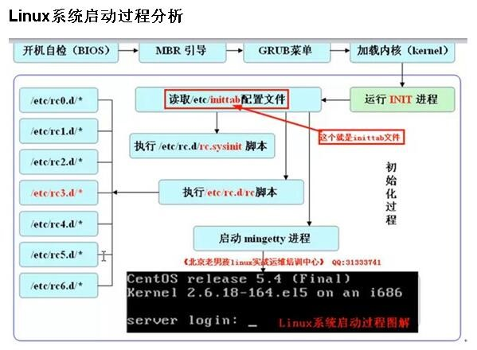

```

PowerOn
   1)BIOS 加电自检
   2)MBR引导
   3)GRUB菜单
   4)加载内核kernel
   5)运行Init进程
        1)读取/etc/inittab配置文件
             1)执行/etc/rc.d/rc.sysinit脚本
             2)执行/etc/rc?.d/下脚本
             3)启动mingetty进程
```
