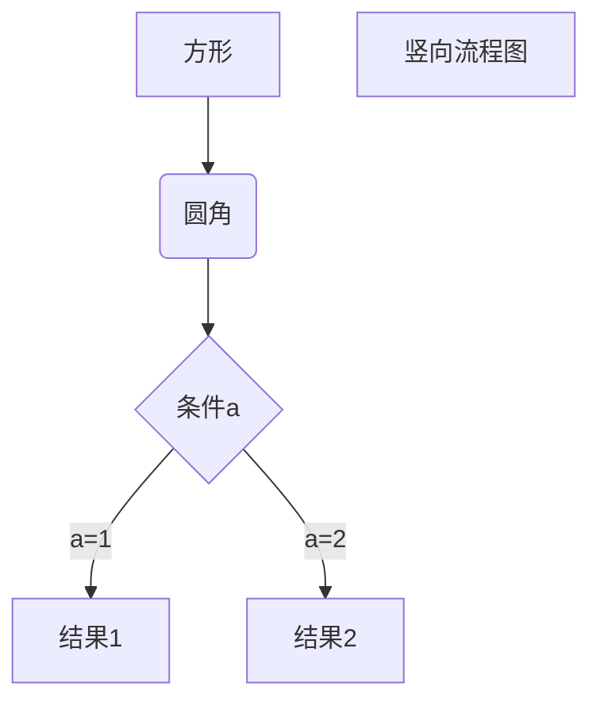

**tcpip**
```
.arp
 ip用来路由
 mac用来通信

 ip.addr == 1.1.1.1

 tcpdump -i eth0 host 1.1.1.1
```


```mermaid
graph TD
A[方形] --> B(圆角)
    B --> C{条件a}
    C --> |a=1| D[结果1]
    C --> |a=2| E[结果2]
    F[竖向流程图]
```
