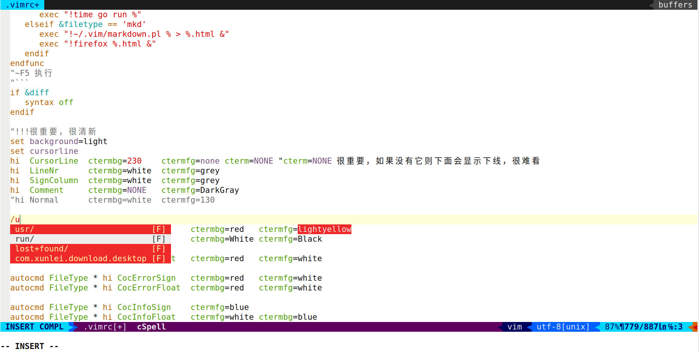

```vim
"安装 coc-pyright 而不是coc-python(有错误)
"apt install ruby-dev
"gem install neovim

"apt install python2.7
"apt install python2.7-dev
"pip install neovim
"pip install --user --upgrade pynvim

"pip3 install neovim
"pip3 install --user --upgrade pynvim

let g:python3_host_prog="/usr/bin/python3"
"
"
"```vim
":Git log %
":Git add %
":Git commit -m "xxx" %
":Git push
"
"<F5> \ga  git add
"<F6> \gc  git commit
"<F7> \gp  git push
"     \gl  git log
"```
"
"**makrdown**
"```vim
"\pp   clipboard's image to pic/xxx.png, add 
"```
"
"**Key Bindings**
"```
" <F2>           Save file
" <F3>           打开关闭DefxTree
" <F4>/<C-c>     关闭buffer
" gt                             切换打开的窗口
" 鼠标双击/<cr>                  打开关闭目录/打开文件
" 鼠标双击/<cr>/<Left>/<Right>   打开关闭目录
"
" h              切换到上一层目录
" D              切换光标下目录为工作区顶级目录
"
" n              创建新文件
" N              创建新目录
" d              删除文件
" r              重命名文件
" m              移动文件
" c              复制文件
" p              粘贴文件
" .              隐藏文件切换
" ~              返回$HOME目录
" <Space>        切换选择与非选择状态
" *              切换所有选择与非选择状态
" j              向下移动光标
" k              向上移动光标
" <c-g>          显示全路径
"```
"**install vim8.2**
"```console
" $ setfacl -R -m d:u:tom:rwx /root
" $ setfacl -R -m u:tom:--- /root/.ssh
"
" $ apt-get install software-properties-common
" $ add-apt-repository ppa:jonathonf/vim
" $ apt update
" $ apt upgrade
" $ apt install python3-pip
" $ ln -s /usr/bin/pip3 /usr/bin/pip
" $ pip install pynvim
"```
"
"**install and ln nvim to vim**
"```console
"apt-get install software-properties-common
"apt-add-repository ppa:neovim-ppa/stable
"apt update
"apt install neovim
"mkdir ~/.config/nvim
"touch ~/.vimrc
"ln ~/.vimrc ~/.config/nvim/init.vim
"
"cat >> ~/.bashrc <<EOF
"alias vim="/usr/bin/nvim"
"alias vi="/usr/bin/nvim"
"alias oldvim="/usr/bin/vim"
"EOF
". ~/.bashrc
"```
"
"**install Plug**
"```console
"#vim & nvim :
"  curl -fLo ~/.vim/autoload/plug.vim --create-dirs https://raw.githubusercontent.com/junegunn/vim-plug/master/plug.vim
"  curl -fLo ~/.config/nvim/autoload/plug.vim --create-dirs https://raw.githubusercontent.com/junegunn/vim-plug/master/plug.vim
"
"```
"
"**:CocInstall (after .vimrc & plug coc installed)**
"```vim
"$ apt install python3 python3-pip python3-venv
"
"$ curl -sL https://deb.nodesource.com/setup_14.x | sudo -E bash -
"$ apt install -y nodejs
"
"bash
":CocInstall coc-sh
"
"php
":CocInstall coc-phpls
"
"c/c++
"$ apt install clangd
":CocInstall coc-clangd
"
"python
":CocInstall coc-pyright
"
"css
":CocInstall coc-css
"
"go
"$ apt install golang
"$ go env -w GO111MODULE=on
"$ go env -w GOPROXY=https://goproxy.cn,direct
":CocInstall coc-go
"
"json
":CocInstall coc-json
"
"snippets
":CocInstall coc-snippets
"```
"
"**.vimrc**
"```vim
set encoding=utf-8
set mouse=a
"折叠处，鼠标双击切换折叠
noremap <2-LeftMouse> za
set hidden

"highlight current line
"set cursorline

"tabexpand
"""""""""""""""""tab"""""""""""""""""""
"缩进
set cindent smartindent
set tabstop=3 shiftwidth=3 softtabstop=-1

"tab转成空格
set expandtab
:autocmd BufEnter *.*,* retab
"""""""""""""""""~tab"""""""""""""""""""

"terminal
set splitbelow
nmap t :terminal<CR>
"~terminal

"save
nmap <F2> :w<CR>
imap <F2> <Esc>:w<CR>a

"..........Git key bindings...........
" <F5> \ga  git add
" <F6> \gc  git commit
" <F7> \gp  git push
"      \gl  git log

"nmap <silent> <F5>       :Git add %<CR>
nmap <silent> <Leader>ga :Git add %<CR>

nmap <silent> <F6>       :call MyGitCommit()<CR>
nmap <silent> <Leader>gc :call MyGitCommit()<CR>

nmap <silent> <F7>       :echo 'pushing...'<CR>:Git push<CR>
nmap <silent> <Leader>gp :echo 'pushing...'<CR>:Git push<CR>

nmap <silent> <Leader>gl :Git log %<CR>

function! MyGitCommit()
  let l:msg = input('Commit Msg: ')
  :execute 'Git commit -m "'.l:msg.'" %'
endfunction
"..........~Git key bindings...........

"vim command line press tab completion list
set wildmenu

set cmdheight=2
set updatetime=300
set shortmess+=c

"通过yy复制后，内容vim与系统可共用
set clipboard=unnamedplus,unnamed

"打开后光标到上次关闭时位置
augroup lastpos
    au!
    au BufReadPost * if line("'\"") > 1 && line("'\"") <= line("$") | exe "normal! g'\"" | endif
augroup END
"~打开后光标到上次关闭时位置

"mkdir -p  ~/.vim/plugin
"cp /usr/share/vim/addons/plugin/matchit.vim ~/.vim/plugin/
let b:match_words='\<if\>:\<elif\>:\<else\>:\<elseif\>:\<fi\>,\<do\>:\<done\>,\<case\>:\<esac\>'

"..................... plugins ......................
"vim& nvim :
"  curl -fLo ~/.vim/autoload/plug.vim --create-dirs https://raw.githubusercontent.com/junegunn/vim-plug/master/plug.vim
"  curl -fLo ~/.config/nvim/autoload/plug.vim --create-dirs https://raw.githubusercontent.com/junegunn/vim-plug/master/plug.vim
call plug#begin('~/.vim/plugged')
"  "colorscheme
"  "sed -i 's/s:comment_grey = s:colors.comment_grey/s:comment_grey = s:colors.blue_purple/ ~/.vim/plugged/palenight.vim/colors/palenight.vim
"  Plug 'drewtempelmeyer/palenight.vim'
"
  "符号自动高亮匹配
  Plug 'luochen1990/rainbow'

  "airline
  Plug 'vim-airline/vim-airline'
  Plug 'vim-airline/vim-airline-themes'
  "~airline

  "git
  Plug 'tpope/vim-fugitive'
  Plug 'airblade/vim-gitgutter'
  Plug 'junegunn/gv.vim'
  "~git

  Plug 'ap/vim-css-color'

  "Plug 'vim-scripts/AutoComplPop'
  Plug 'hrsh7th/vim-vsnip'
  Plug 'hrsh7th/vim-vsnip-integ'

  "others
  Plug 'majutsushi/tagbar'
  Plug 'vim-scripts/txt.vim'
  Plug 'mattn/emmet-vim'
  Plug 'stephpy/vim-yaml'
  Plug 'ekalinin/Dockerfile.vim'
  Plug 'othree/html5.vim'
  Plug 'chrisbra/unicode.vim'

  "markdown
  "apt install xclip
  Plug 'godlygeek/tabular'
  Plug 'plasticboy/vim-markdown'
  Plug 'ferrine/md-img-paste.vim'
  "~markdown

  "apt install python3-pip; ln -s /usr/bin/pip3 /usr/bin/pip
  "pip install pynvim
  if has('nvim')
      Plug 'Shougo/defx.nvim', { 'do': ':UpdateRemotePlugins' }
  else
      Plug 'Shougo/defx.nvim'
      Plug 'roxma/nvim-yarp'
      Plug 'roxma/vim-hug-neovim-rpc'
      Plug 'kristijanhusak/defx-icons'
      Plug 'kristijanhusak/defx-git'
  endif

  Plug 'liuchengxu/vista.vim'  " tagbar 超集替代品
  Plug 'neoclide/coc.nvim', {'branch': 'release'}
  Plug 'vim-syntastic/syntastic'
call plug#end()


"palenight
"colorscheme palenight
"~palenight


"...................coc............................
  inoremap <silent><expr> <TAB>
        \ pumvisible() ? "\<C-n>" :
        \ <SID>check_back_space() ? "\<TAB>" :
        \ coc#refresh()
  inoremap <silent><expr><S-TAB> pumvisible() ? "\<C-p>" : "\<C-h>"

  function! s:check_back_space() abort
    let col = col('.') - 1
    return !col || getline('.')[col - 1]  =~# '\s'
  endfunction

  " Use <c-space> to trigger completion.
  if has('nvim')
    inoremap <silent><expr> <c-space> coc#refresh()
  else
    inoremap <silent><expr> <c-@> coc#refresh()
  endif

  inoremap <silent><expr> <cr> pumvisible() ? coc#_select_confirm()
                                \: "\<C-g>u\<CR>\<c-r>=coc#on_enter()\<CR>"

  nmap <silent> [g <Plug>(coc-diagnostic-prev)
  nmap <silent> ]g <Plug>(coc-diagnostic-next)

  nmap <silent> gd <Plug>(coc-definition)
  nmap <silent> gy <Plug>(coc-type-definition)
  nmap <silent> gi <Plug>(coc-implementation)
  nmap <silent> gr <Plug>(coc-references)

  function! s:show_documentation()
    if (index(['vim','help'], &filetype) >= 0)
      execute 'h '.expand('<cword>')
    elseif (coc#rpc#ready())
      call CocActionAsync('doHover')
    else
      execute '!' . &keywordprg . " " . expand('<cword>')
    endif
  endfunction

  nmap <silent> K :call <SID>show_documentation()<CR>
  "autocmd CursorHold *.php,*.py,*.c,*.sh silent call CocActionAsync('doHover')

  nmap <leader>rn <Plug>(coc-rename)

  xmap <leader>f  <Plug>(coc-format-selected)
  nmap <leader>f  <Plug>(coc-format-selected)

  augroup mygroup
    autocmd!
    autocmd FileType typescript,json setl formatexpr=CocAction('formatSelected')
    autocmd User CocJumpPlaceholder call CocActionAsync('showSignatureHelp')
  augroup end

  xmap <leader>a  <Plug>(coc-codeaction-selected)
  nmap <leader>a  <Plug>(coc-codeaction-selected)

  nmap <leader>ac  <Plug>(coc-codeaction)
  nmap <leader>qf  <Plug>(coc-fix-current)

  xmap if <Plug>(coc-funcobj-i)
  omap if <Plug>(coc-funcobj-i)
  xmap af <Plug>(coc-funcobj-a)
  omap af <Plug>(coc-funcobj-a)
  xmap ic <Plug>(coc-classobj-i)
  omap ic <Plug>(coc-classobj-i)
  xmap ac <Plug>(coc-classobj-a)
  omap ac <Plug>(coc-classobj-a)

  if has('nvim-0.4.0') || has('patch-8.2.0750')
    nmap <silent><nowait><expr> <C-f> coc#float#has_scroll() ? coc#float#scroll(1) : "\<C-f>"
    nmap <silent><nowait><expr> <C-b> coc#float#has_scroll() ? coc#float#scroll(0) : "\<C-b>"
    inoremap <silent><nowait><expr> <C-f> coc#float#has_scroll() ? "\<c-r>=coc#float#scroll(1)\<cr>" : "\<Right>"
    inoremap <silent><nowait><expr> <C-b> coc#float#has_scroll() ? "\<c-r>=coc#float#scroll(0)\<cr>" : "\<Left>"
    vnoremap <silent><nowait><expr> <C-f> coc#float#has_scroll() ? coc#float#scroll(1) : "\<C-f>"
    vnoremap <silent><nowait><expr> <C-b> coc#float#has_scroll() ? coc#float#scroll(0) : "\<C-b>"
  endif

  nmap <silent> <C-s> <Plug>(coc-range-select)
  xmap <silent> <C-s> <Plug>(coc-range-select)

  command! -nargs=0 Format :call CocAction('format')

  command! -nargs=? Fold :call     CocAction('fold', <f-args>)

  command! -nargs=0 OR   :call     CocAction('runCommand', 'editor.action.organizeImport')

  set statusline^=%{coc#status()}%{get(b:,'coc_current_function','')}
  set statusline^=%{get(g:,'coc_git_status','')}%{get(b:,'coc_git_status','')}%{get(b:,'coc_git_blame','')}

  nmap <silent><nowait> <space>a  :<C-u>CocList diagnostics<cr>
  nmap <silent><nowait> <space>e  :<C-u>CocList extensions<cr>
  nmap <silent><nowait> <space>c  :<C-u>CocList commands<cr>
  nmap <silent><nowait> <space>o  :<C-u>CocList outline<cr>
  nmap <silent><nowait> <space>s  :<C-u>CocList -I symbols<cr>
  nmap <silent><nowait> <space>j  :<C-u>CocNext<CR>
  nmap <silent><nowait> <space>k  :<C-u>CocPrev<CR>
  nmap <silent><nowait> <space>p  :<C-u>CocListResume<CR>

  "scroll popup window
  nmap <expr> <c-d> Misc_popup_scroll_cursor_popup(1) ? '<esc>' : '<c-d>'
  nmap <expr> <c-u> Misc_popup_scroll_cursor_popup(0) ? '<esc>' : '<c-u>'

  function! Misc_popup_find_cursor_popup(...)
    let radius = get(a:000, 0, 2)
    let srow = screenrow()
    let scol = screencol()

    " it's necessary to test entire rect, as some popup might be quite small
    for r in range(srow - radius, srow + radius)
      for c in range(scol - radius, scol + radius)
        let winid = popup_locate(r, c)
        if winid != 0
          return winid
        endif
      endfor
    endfor

    return 0
  endfunction

  function! Misc_popup_scroll_cursor_popup(down)
    let winid = Misc_popup_find_cursor_popup()
    if winid == 0
      return 0
    endif

    let pp = popup_getpos(winid)
    call popup_setoptions( winid,
          \ {'firstline' : pp.firstline + ( a:down ? 1 : -1 ) } )

    return 1
  endfunction
  "~scroll popup window
"~...................coc............................

"airline
  "let g:airline_powerline_fonts = 1
  if !exists('g:airline_symbols')
     let g:airline_symbols = {}
  endif

  "unicode symbols
  let g:airline_left_sep = '»'
  let g:airline_left_sep = '▶'
  let g:airline_right_sep = '«'
  let g:airline_right_sep = '◀'
  let g:airline_symbols.crypt = '🔒'
  let g:airline_symbols.linenr = '☰'
  let g:airline_symbols.linenr = '␊'
  let g:airline_symbols.linenr = '␤'
  let g:airline_symbols.linenr = '¶'
  let g:airline_symbols.maxlinenr = ''
  let g:airline_symbols.maxlinenr = '㏑'
  let g:airline_symbols.branch = '⎇'
  let g:airline_symbols.paste = 'ρ'
  let g:airline_symbols.paste = 'Þ'
  let g:airline_symbols.paste = '∥'
  let g:airline_symbols.spell = 'Ꞩ'
  let g:airline_symbols.notexists = 'Ɇ'
  let g:airline_symbols.whitespace = 'Ξ'

  let g:airline#extensions#tabline#enabled = 2
  let g:airline#extensions#tabline#left_sep = ' '
  let g:airline#extensions#tabline#left_alt_sep = '|'
  let g:airline#extensions#tabline#formatter = 'default'
  let g:airline_theme="dark"
"~airline

"rainbow
let g:rainbow_active = 1
"~rainbow

"gitgutter
"highlight SignColumn guibg=darkgray ctermbg=darkgray

".............. bclose ................
" Load plugin once.
if exists('g:loaded_bclose')
    finish
endif
let g:loaded_bclose = 1

function! s:Warn(msg)
  echohl ErrorMsg
  echomsg a:msg
  echohl NONE
endfunction

function! s:Bclose(bang)
    if(!buflisted(winbufnr(0)))
      bw!
      return
    endif
    let s:bufNum = bufnr("%")
    let s:bufName = bufname("%")
    let s:winNum = winnr()
    if empty(a:bang) && getbufvar(s:bufNum, '&modified')
        call s:Warn('No write since last change for buffer '
                    \ .s:bufName. ' (use :Bclose!)')
        return
    endif
    let prevbufvar = bufnr("#")
    if(prevbufvar > 0 && buflisted(prevbufvar) && prevbufvar != s:bufNum)
        bn
    else
       bn
    endif
    execute s:winNum . 'wincmd w'
    let s:buflistedLeft = 0
    let s:bufFinalJump = 0
    let l:nBufs = bufnr("$")
    let l:i = 1
    if( len(filter(range(1, bufnr('$')), 'buflisted(v:val)')) > 1)
    while(l:i < l:nBufs)
      if(l:i != s:bufNum)
        if(buflisted(l:i))
          let s:buflistedLeft = s:buflistedLeft + 1
        else
          if(bufexists(l:i) && !strlen(bufname(l:i)) && !s:bufFinalJump)
            let s:bufFinalJump = l:i
          endif
        endif
      endif
      let l:i = l:i + 1
    endwhile

    if(!s:buflistedLeft)
      if(s:bufFinalJump)
        windo if(buflisted(winbufnr(0))) | execute "b! " . s:bufFinalJump | endif
      else
        enew
        let l:newBuf = bufnr("%")
        windo if(buflisted(winbufnr(0))) | execute "b! " . l:newBuf | endif
      endif
      execute s:winNum . 'wincmd w'
    endif

    if(buflisted(s:bufNum) || s:bufNum == bufnr("%"))
      execute "bw! " . s:bufNum
    endif

    if(!s:buflistedLeft)
      set buflisted
      set bufhidden=delete
      set buftype=
      setlocal noswapfile
    endif
    endif
endfunction

command! -bang -complete=buffer -nargs=? Bclose call s:Bclose('<bang>')
nnoremap <silent> <Plug>Bclose :<C-u>Bclose<CR>
".............. ~bclose ................

"...............defx...................
" <F3>           打开关闭DefxTree
" <F4>/<C-c>     关闭buffer
" gt                             切换打开的窗口
" 鼠标双击/<cr>                  打开关闭目录/打开文件
" 鼠标双击/<cr>/<Left>/<Right>   打开关闭目录
"
" h              切换到上一层目录
" D              切换光标下目录为工作区顶级目录
"
" n              创建新文件
" N              创建新目录
" d              删除文件
" r              重命名文件
" m              移动文件
" c              复制文件
" p              粘贴文件
" .              隐藏文件切换
" ~              返回$HOME目录
" <Space>        切换选择与非选择状态
" *              切换所有选择与非选择状态
" j              向下移动光标
" k              向上移动光标
" <c-g>          显示全路径

map <C-C> :Bclose<CR>
map <F4>  :Bclose<CR>
map <F3>  :Defx<CR>
autocmd FileType defx call s:defx_my_settings()

function! s:SID_PREFIX() abort
  return matchstr(expand('<sfile>'),
        \ '<SNR>\d\+_\zeSID_PREFIX$')
endfunction
let g:defx_config_sid = s:SID_PREFIX()

call defx#custom#option('_', {
      \ 'winwidth': 20,
      \ 'split': 'vertical',
      \ 'direction': 'topleft',
      \ 'show_ignored_files': 0,
      \ 'buffer_name': 'defxtree',
      \ 'toggle': 1,
      \ 'resume': 1
      \ })

call defx#custom#option('open', {
      \ 'winwidth': 20,
      \ 'split': 'vsplit',
      \ 'direction': 'topleft',
      \ 'show_ignored_files': 0,
      \ 'buffer_name': 'defxtree',
      \ 'toggle': 1,
      \ 'resume': 1
      \ })

call defx#custom#column('icon', {
      \ 'directory_icon': '▸',
      \ 'opened_icon': '▾',
      \ 'root_icon': ' ',
      \ })

call defx#custom#column('filename', {
      \ 'min_width': 40,
      \ 'max_width': 40,
      \ })

call defx#custom#column('mark', {
      \ 'readonly_icon': '✗',
      \ 'selected_icon': '✓',
      \ })


function! s:defx_my_settings() abort
   nmap <silent>               gt      :bn<cr>

   nmap <silent><buffer><expr> h       defx#do_action('call', g:defx_config_sid . 'DefxSmartH')
   nmap <silent><buffer><expr> <Left>  defx#do_action('call', g:defx_config_sid . 'DefxSmartL')

   nmap <silent><buffer><expr> <Right> defx#do_action('call', g:defx_config_sid . 'DefxSmartR')
   nmap <silent><buffer><expr> o       defx#do_action('call', g:defx_config_sid . 'DefxSmartOpen')

   nmap <silent><buffer><expr> <2-LeftMouse> defx#is_directory() ?
       \ (defx#is_opened_tree() ? defx#do_action('close_tree') : defx#do_action('open_tree') ):
       \ defx#do_action('drop')

   nmap <silent><buffer><expr> <CR>  defx#do_action('call', g:defx_config_sid . 'DefxSmartOpen')
   nmap <silent><buffer><expr> <S-D> defx#do_action('call', g:defx_config_sid . 'DefxSmartChangeDir')

   nmap <silent><buffer><expr> .     defx#do_action('toggle_ignored_files')

   nmap <silent><buffer><expr> n     defx#do_action('new_file')
   nmap <silent><buffer><expr> N     defx#do_action('new_directory')
   nmap <silent><buffer><expr> r     defx#do_action('rename')
   nmap <silent><buffer><expr> d     defx#do_action('remove')

   nmap <silent><buffer><expr> m     defx#do_action('move')
   nmap <silent><buffer><expr> c     defx#do_action('copy')
   nmap <silent><buffer><expr> p     defx#do_action('paste')

   nmap <silent><buffer><expr> ~     defx#do_action('cd')
   nmap <silent><buffer><expr> yy    defx#do_action('yank_path')

   nmap <silent><buffer><expr> j     line('.') == line('$') ? 'gg' : 'j'
   nmap <silent><buffer><expr> k     line('.') == 1 ? 'G' : 'k'

   nmap <silent><buffer><expr> <Space> defx#do_action('toggle_select') . 'j'
   nmap <silent><buffer><expr> *     defx#do_action('toggle_select_all')
   nmap <silent><buffer><expr> <C-g> defx#do_action('print')

   nmap <silent><buffer><expr> s     defx#do_action('toggle_sort', 'time')
   nmap <silent><buffer><expr> E     defx#do_action('open', 'vsplit')
   nmap <silent><buffer><expr> ;     defx#do_action('repeat')
   nmap <silent><buffer><expr> C
     \ defx#do_action('toggle_columns', 'mark:indent:icon:filename:type:size:time')
endfunction

scriptencoding utf-8
 function! s:DefxSmartOpen(_)
   if defx#is_directory()
     call defx#call_action('open_tree')
     normal! j
   else
     let filepath = defx#get_candidate()['action__path']
     if tabpagewinnr(tabpagenr(), '$') >= 3
       if exists(':ChooseWin') == 2
         ChooseWin
       else
         let input = input('ChooseWin No./Cancel(n): ')
         if input ==# 'n' | return | endif
         if input == winnr() | return | endif
         exec input . 'wincmd w'
       endif
       exec 'e' filepath
     else
       exec 'wincmd w'
       exec 'e' filepath
     endif
   endif
 endfunction

 function! s:DefxSmartR(_)
   if defx#is_directory()
     call defx#call_action('open_tree')
     "normal! j
   endif
 endfunction

  function! s:DefxSmartL(_)
   if defx#is_directory()
     call defx#call_action('open_tree')
   endif
 endfunction

 function! s:DefxSmartChangeDir(_)
   let s:candidate = defx#get_candidate()
   let s:parent = fnamemodify(s:candidate['action__path'], s:candidate['is_directory'] ? ':p:h' : ':p:h')
   return defx#call_action('cd', s:parent)
 endfunction

 function! s:DefxSmartH(_)
   if line('.') ==# 1 || line('$') ==# 1
     return defx#call_action('cd', ['..'])
   endif

   if defx#is_opened_tree()
     return defx#call_action('close_tree')
   endif

   let s:candidate = defx#get_candidate()
   let s:parent = fnamemodify(s:candidate['action__path'], s:candidate['is_directory'] ? ':p:h:h' : ':p:h')
   let sep = '/'
   if s:trim_right(s:parent, sep) == s:trim_right(b:defx.paths[0], sep)
     return defx#call_action('cd', ['..'])
   endif

   call defx#call_action('search', s:parent)

   call defx#call_action('close_tree')
 endfunction
"...............~defx...................

".........save clipboard's image..........
"\pp to save clipboard's image into pic/xxx.png, and insert
"
let g:mdip_imgdir = 'pic'
let g:mdip_imgname = 'image'
autocmd FileType markdown nnoremap <silent> <Leader>pp :call mdip#MarkdownClipboardImage()<CR>avatar
".........~save clipboard's image..........
"
"透明
"set statusline=%1*\%<%.50F\                 "显示文件名和文件路径 (%<应该可以去掉)
"set statusline+=%=%2*\%y%m%r%h%w\ %*        "显示文件类型及文件状态
"set statusline+=%3*\%{&ff}\[%{&fenc}]\ %*   "显示文件编码类型
"set statusline+=%4*\ row:%l/%L,col:%c\ %*   "显示光标所在行和列
"set statusline+=%5*\%3p%%\%*                "显示光标前文本所占总文本的比例

"markdown
let g:vim_markdown_folding_disabled = 1

"latstatus
"set laststatus=1

"F5 执行
map <F5> :call CompileRunGcc()<CR>
func! CompileRunGcc()
   exec "w"
   if &filetype == 'c'
      exec "!g++ % -o %<"
      exec "!time ./%<"
   elseif &filetype == 'cpp'
      exec "!g++ % -o %<"
      exec "!time ./%<"
   elseif &filetype == 'java'
      exec "!javac %"
      exec "!time java %<"
   elseif &filetype == 'sh'
      :!time bash %
   elseif &filetype == 'python'
      exec "!time python3 %"
   elseif &filetype == 'html'
      exec "!firefox % &"
   elseif &filetype == 'go'
      exec "!go build %<"
      exec "!time go run %"
   elseif &filetype == 'mkd'
      exec "!~/.vim/markdown.pl % > %.html &"
      exec "!firefox %.html &"
   endif
endfunc
"~F5 执行
"```
if &diff
   syntax off
endif

"!!!很重要，很清新
set background=light
set cursorline
hi  CursorLine  ctermbg=230    ctermfg=none
hi  LineNr      ctermbg=white  ctermfg=grey
hi  SignColumn  ctermbg=white  ctermfg=grey
hi  Comment     ctermbg=NONE   ctermfg=DarkGray
"hi Normal      ctermbg=white  ctermfg=130

autocmd FileType * hi Pmenu          ctermbg=red   ctermfg=lightyellow
autocmd FileType * hi PmenuSel       ctermbg=White ctermfg=Black

autocmd FileType * hi CocHintFloat   ctermbg=red   ctermfg=white

autocmd FileType * hi CocErrorSign   ctermbg=red   ctermfg=white
autocmd FileType * hi CocErrorFloat  ctermbg=red   ctermfg=white

autocmd FileType * hi CocInfoSign    ctermfg=blue
autocmd FileType * hi CocInfoFloat   ctermfg=white ctermbg=blue

autocmd FileType * hi CocWarningSign ctermfg=white ctermbg=yellow

autocmd FileType * hi FgCocErrorFloatBgCocFloating ctermfg=white ctermbg=darkred
"~!!!很重要，很清新

"!!!高亮空白字符
highlight ExtraWhitespace ctermbg=lightred guibg=red
match ExtraWhitespace /\s\+$/
au BufWinEnter * match ExtraWhitespace /\s\+$/
au InsertEnter * match ExtraWhitespace /\s\+\%#\@<!$/
au InsertLeave * match ExtraWhitespace /\s\+$/
au BufWinLeave * call clearmatches()
"~!!!高亮空白字符

"!!!保存前删除空格
function BeforeSave()
   %s/\s\+$//e "delete the whitespaces end of the line
endfunction

autocmd BufWritePre *  :call BeforeSave()
"~!!!保存前删除空格

"!!!set title
"/**
" * Copyright (C) 2021 All rights reserved.
" *
" * FileName      : a.c
" * Author        : tomyao
" * Email         : tomyao@tom.com
" * Date          : 2021年11月16日
" * Description   :
" */

autocmd BufNewFile *.c,*.go,*.php exec ":call SetTitle()"
    func SetTitle()
         if expand("%:e") == "php"
           call setline(1,"<?php")
           call append(line("."),    "/**")
           let lnum=1
        else
           call setline(1,           "/**")
           let lnum=0
        endif

        call append(line(".")+lnum, " * Copyright (C) ".strftime("%Y")." All rights reserved.")
        call append(line(".")+lnum+1, " *")
        call append(line(".")+lnum+2, " * FileName      : ".expand("%:t"))
        call append(line(".")+lnum+3, " * Author        : tomyao")
        call append(line(".")+lnum+4, " * Email         : tomyao@tom.com")
        call append(line(".")+lnum+5, " * Date          : ")
        call append(line(".")+lnum+6, " * Description   : ")
        call append(line(".")+lnum+7, " */")
    endfunc

"#!/bin/bash
"# Copyright (C) 2021 All rights reserved.
"#
"# FileName      : b.sh
"# Author        : tomyao
"# Email         : tomyao@tom.com
"# Date          : 2021年11月16日
"# Description   :

autocmd BufNewFile *.sh,*.py exec ":call SetTitleBash()"
    func SetTitleBash()
       if expand("%:e") == "sh"
        call setline(1,          "#!/bin/bash")
     else
        call setline(1,          "#!/usr/bin/python3")
     endif
        call append(line("."),   "# Copyright (C) ".strftime("%Y")." All rights reserved.")
        call append(line(".")+1, "#")
        call append(line(".")+2, "# FileName      : ".expand("%:t"))
        call append(line(".")+3, "# Author        : tomyao")
        call append(line(".")+4, "# Email         : tomyao@tom.com")
        call append(line(".")+5, "# Date          : ")
        call append(line(".")+6, "# Description   : ")
        call append(line(".")+7, "")
        call append(line(".")+7, "")
    endfunc

autocmd BufNewFile * normal G

func AddTime()
   let l:ext = expand("%:e")
   if ext == "c" || ext == "cpp" || ext == "go" || ext == "php"
      /^\s*\*\s\+Date\s\+:
   elseif ext == "sh" || ext == "py"
      /^\s*\#\s\+Date\s\+:
   endif
      call setline(line("."),substitute(getline(line(".")),'\s*$',strftime(" %Y%m%dT%H%M"),'g'))
endfunc

autocmd BufWritePre *.c,*.go,*.php,*.sh,*.py :call AddTime()
"~!!!set title


root@tom:~# vim a.c
root@tom:~# cat ~/.vimrc 
"安装 coc-pyright 而不是coc-python(有错误)
"apt install ruby-dev
"gem install neovim

"apt install python2.7
"apt install python2.7-dev
"pip install neovim
"pip install --user --upgrade pynvim

"pip3 install neovim
"pip3 install --user --upgrade pynvim

let g:python3_host_prog="/usr/bin/python3"
"
"
"```vim
":Git log %
":Git add %
":Git commit -m "xxx" %
":Git push
"
"<F5> \ga  git add
"<F6> \gc  git commit
"<F7> \gp  git push
"     \gl  git log
"```
"
"**makrdown**
"```vim
"\pp   clipboard's image to pic/xxx.png, add 
"```
"
"**Key Bindings**
"```
" <F2>           Save file
" <F3>           打开关闭DefxTree
" <F4>/<C-c>     关闭buffer
" gt                             切换打开的窗口
" 鼠标双击/<cr>                  打开关闭目录/打开文件
" 鼠标双击/<cr>/<Left>/<Right>   打开关闭目录
"
" h              切换到上一层目录
" D              切换光标下目录为工作区顶级目录
"
" n              创建新文件
" N              创建新目录
" d              删除文件
" r              重命名文件
" m              移动文件
" c              复制文件
" p              粘贴文件
" .              隐藏文件切换
" ~              返回$HOME目录
" <Space>        切换选择与非选择状态
" *              切换所有选择与非选择状态
" j              向下移动光标
" k              向上移动光标
" <c-g>          显示全路径
"```
"**install vim8.2**
"```console
" $ setfacl -R -m d:u:tom:rwx /root
" $ setfacl -R -m u:tom:--- /root/.ssh
"
" $ apt-get install software-properties-common
" $ add-apt-repository ppa:jonathonf/vim
" $ apt update
" $ apt upgrade
" $ apt install python3-pip
" $ ln -s /usr/bin/pip3 /usr/bin/pip
" $ pip install pynvim
"```
"
"**install and ln nvim to vim**
"```console
"apt-get install software-properties-common
"apt-add-repository ppa:neovim-ppa/stable
"apt update
"apt install neovim
"mkdir ~/.config/nvim
"touch ~/.vimrc
"ln ~/.vimrc ~/.config/nvim/init.vim
"
"cat >> ~/.bashrc <<EOF
"alias vim="/usr/bin/nvim"
"alias vi="/usr/bin/nvim"
"alias oldvim="/usr/bin/vim"
"EOF
". ~/.bashrc
"```
"
"**install Plug**
"```console
"#vim & nvim :
"  curl -fLo ~/.vim/autoload/plug.vim --create-dirs https://raw.githubusercontent.com/junegunn/vim-plug/master/plug.vim
"  curl -fLo ~/.config/nvim/autoload/plug.vim --create-dirs https://raw.githubusercontent.com/junegunn/vim-plug/master/plug.vim
"
"```
"
"**:CocInstall (after .vimrc & plug coc installed)**
"```vim
"$ apt install python3 python3-pip python3-venv
"
"$ curl -sL https://deb.nodesource.com/setup_14.x | sudo -E bash -
"$ apt install -y nodejs
"
"bash
":CocInstall coc-sh
"
"php
":CocInstall coc-phpls
"
"c/c++
"$ apt install clangd
":CocInstall coc-clangd
"
"python
":CocInstall coc-pyright
"
"css
":CocInstall coc-css
"
"go
"$ apt install golang
"$ go env -w GO111MODULE=on
"$ go env -w GOPROXY=https://goproxy.cn,direct
":CocInstall coc-go
"
"json
":CocInstall coc-json
"
"snippets
":CocInstall coc-snippets
"```
"
"**.vimrc**
"```vim
set encoding=utf-8
set mouse=a
"折叠处，鼠标双击切换折叠
noremap <2-LeftMouse> za
set hidden

"highlight current line
"set cursorline

"tabexpand
"""""""""""""""""tab"""""""""""""""""""
"缩进
set cindent smartindent
set tabstop=3 shiftwidth=3 softtabstop=-1

"tab转成空格
set expandtab
:autocmd BufEnter *.*,* retab
"""""""""""""""""~tab"""""""""""""""""""

"terminal
set splitbelow
nmap t :terminal<CR>
"~terminal

"save
nmap <F2> :w<CR>
imap <F2> <Esc>:w<CR>a

"..........Git key bindings...........
" <F5> \ga  git add
" <F6> \gc  git commit
" <F7> \gp  git push
"      \gl  git log

"nmap <silent> <F5>       :Git add %<CR>
nmap <silent> <Leader>ga :Git add %<CR>

nmap <silent> <F6>       :call MyGitCommit()<CR>
nmap <silent> <Leader>gc :call MyGitCommit()<CR>

nmap <silent> <F7>       :echo 'pushing...'<CR>:Git push<CR>
nmap <silent> <Leader>gp :echo 'pushing...'<CR>:Git push<CR>

nmap <silent> <Leader>gl :Git log %<CR>

function! MyGitCommit()
  let l:msg = input('Commit Msg: ')
  :execute 'Git commit -m "'.l:msg.'" %'
endfunction
"..........~Git key bindings...........

"vim command line press tab completion list
set wildmenu

set cmdheight=2
set updatetime=300
set shortmess+=c

"通过yy复制后，内容vim与系统可共用
set clipboard=unnamedplus,unnamed

"打开后光标到上次关闭时位置
augroup lastpos
    au!
    au BufReadPost * if line("'\"") > 1 && line("'\"") <= line("$") | exe "normal! g'\"" | endif
augroup END
"~打开后光标到上次关闭时位置

"mkdir -p  ~/.vim/plugin
"cp /usr/share/vim/addons/plugin/matchit.vim ~/.vim/plugin/
let b:match_words='\<if\>:\<elif\>:\<else\>:\<elseif\>:\<fi\>,\<do\>:\<done\>,\<case\>:\<esac\>'

"..................... plugins ......................
"vim& nvim :
"  curl -fLo ~/.vim/autoload/plug.vim --create-dirs https://raw.githubusercontent.com/junegunn/vim-plug/master/plug.vim
"  curl -fLo ~/.config/nvim/autoload/plug.vim --create-dirs https://raw.githubusercontent.com/junegunn/vim-plug/master/plug.vim
call plug#begin('~/.vim/plugged')
"  "colorscheme
"  "sed -i 's/s:comment_grey = s:colors.comment_grey/s:comment_grey = s:colors.blue_purple/ ~/.vim/plugged/palenight.vim/colors/palenight.vim
"  Plug 'drewtempelmeyer/palenight.vim'
"
  "符号自动高亮匹配
  Plug 'luochen1990/rainbow'

  "airline
  Plug 'vim-airline/vim-airline'
  Plug 'vim-airline/vim-airline-themes'
  "~airline

  "git
  Plug 'tpope/vim-fugitive'
  Plug 'airblade/vim-gitgutter'
  Plug 'junegunn/gv.vim'
  "~git

  Plug 'ap/vim-css-color'

  "Plug 'vim-scripts/AutoComplPop'
  Plug 'hrsh7th/vim-vsnip'
  Plug 'hrsh7th/vim-vsnip-integ'

  "others
  Plug 'majutsushi/tagbar'
  Plug 'vim-scripts/txt.vim'
  Plug 'mattn/emmet-vim'
  Plug 'stephpy/vim-yaml'
  Plug 'ekalinin/Dockerfile.vim'
  Plug 'othree/html5.vim'
  Plug 'chrisbra/unicode.vim'

  "markdown
  "apt install xclip
  Plug 'godlygeek/tabular'
  Plug 'plasticboy/vim-markdown'
  Plug 'ferrine/md-img-paste.vim'
  "~markdown

  "apt install python3-pip; ln -s /usr/bin/pip3 /usr/bin/pip
  "pip install pynvim
  if has('nvim')
      Plug 'Shougo/defx.nvim', { 'do': ':UpdateRemotePlugins' }
  else
      Plug 'Shougo/defx.nvim'
      Plug 'roxma/nvim-yarp'
      Plug 'roxma/vim-hug-neovim-rpc'
      Plug 'kristijanhusak/defx-icons'
      Plug 'kristijanhusak/defx-git'
  endif

  Plug 'liuchengxu/vista.vim'  " tagbar 超集替代品
  Plug 'neoclide/coc.nvim', {'branch': 'release'}
  Plug 'vim-syntastic/syntastic'
call plug#end()


"palenight
"colorscheme palenight
"~palenight


"...................coc............................
  inoremap <silent><expr> <TAB>
        \ pumvisible() ? "\<C-n>" :
        \ <SID>check_back_space() ? "\<TAB>" :
        \ coc#refresh()
  inoremap <silent><expr><S-TAB> pumvisible() ? "\<C-p>" : "\<C-h>"

  function! s:check_back_space() abort
    let col = col('.') - 1
    return !col || getline('.')[col - 1]  =~# '\s'
  endfunction

  " Use <c-space> to trigger completion.
  if has('nvim')
    inoremap <silent><expr> <c-space> coc#refresh()
  else
    inoremap <silent><expr> <c-@> coc#refresh()
  endif

  inoremap <silent><expr> <cr> pumvisible() ? coc#_select_confirm()
                                \: "\<C-g>u\<CR>\<c-r>=coc#on_enter()\<CR>"

  nmap <silent> [g <Plug>(coc-diagnostic-prev)
  nmap <silent> ]g <Plug>(coc-diagnostic-next)

  nmap <silent> gd <Plug>(coc-definition)
  nmap <silent> gy <Plug>(coc-type-definition)
  nmap <silent> gi <Plug>(coc-implementation)
  nmap <silent> gr <Plug>(coc-references)

  function! s:show_documentation()
    if (index(['vim','help'], &filetype) >= 0)
      execute 'h '.expand('<cword>')
    elseif (coc#rpc#ready())
      call CocActionAsync('doHover')
    else
      execute '!' . &keywordprg . " " . expand('<cword>')
    endif
  endfunction

  nmap <silent> K :call <SID>show_documentation()<CR>
  "autocmd CursorHold *.php,*.py,*.c,*.sh silent call CocActionAsync('doHover')

  nmap <leader>rn <Plug>(coc-rename)

  xmap <leader>f  <Plug>(coc-format-selected)
  nmap <leader>f  <Plug>(coc-format-selected)

  augroup mygroup
    autocmd!
    autocmd FileType typescript,json setl formatexpr=CocAction('formatSelected')
    autocmd User CocJumpPlaceholder call CocActionAsync('showSignatureHelp')
  augroup end

  xmap <leader>a  <Plug>(coc-codeaction-selected)
  nmap <leader>a  <Plug>(coc-codeaction-selected)

  nmap <leader>ac  <Plug>(coc-codeaction)
  nmap <leader>qf  <Plug>(coc-fix-current)

  xmap if <Plug>(coc-funcobj-i)
  omap if <Plug>(coc-funcobj-i)
  xmap af <Plug>(coc-funcobj-a)
  omap af <Plug>(coc-funcobj-a)
  xmap ic <Plug>(coc-classobj-i)
  omap ic <Plug>(coc-classobj-i)
  xmap ac <Plug>(coc-classobj-a)
  omap ac <Plug>(coc-classobj-a)

  if has('nvim-0.4.0') || has('patch-8.2.0750')
    nmap <silent><nowait><expr> <C-f> coc#float#has_scroll() ? coc#float#scroll(1) : "\<C-f>"
    nmap <silent><nowait><expr> <C-b> coc#float#has_scroll() ? coc#float#scroll(0) : "\<C-b>"
    inoremap <silent><nowait><expr> <C-f> coc#float#has_scroll() ? "\<c-r>=coc#float#scroll(1)\<cr>" : "\<Right>"
    inoremap <silent><nowait><expr> <C-b> coc#float#has_scroll() ? "\<c-r>=coc#float#scroll(0)\<cr>" : "\<Left>"
    vnoremap <silent><nowait><expr> <C-f> coc#float#has_scroll() ? coc#float#scroll(1) : "\<C-f>"
    vnoremap <silent><nowait><expr> <C-b> coc#float#has_scroll() ? coc#float#scroll(0) : "\<C-b>"
  endif

  nmap <silent> <C-s> <Plug>(coc-range-select)
  xmap <silent> <C-s> <Plug>(coc-range-select)

  command! -nargs=0 Format :call CocAction('format')

  command! -nargs=? Fold :call     CocAction('fold', <f-args>)

  command! -nargs=0 OR   :call     CocAction('runCommand', 'editor.action.organizeImport')

  set statusline^=%{coc#status()}%{get(b:,'coc_current_function','')}
  set statusline^=%{get(g:,'coc_git_status','')}%{get(b:,'coc_git_status','')}%{get(b:,'coc_git_blame','')}

  nmap <silent><nowait> <space>a  :<C-u>CocList diagnostics<cr>
  nmap <silent><nowait> <space>e  :<C-u>CocList extensions<cr>
  nmap <silent><nowait> <space>c  :<C-u>CocList commands<cr>
  nmap <silent><nowait> <space>o  :<C-u>CocList outline<cr>
  nmap <silent><nowait> <space>s  :<C-u>CocList -I symbols<cr>
  nmap <silent><nowait> <space>j  :<C-u>CocNext<CR>
  nmap <silent><nowait> <space>k  :<C-u>CocPrev<CR>
  nmap <silent><nowait> <space>p  :<C-u>CocListResume<CR>

  "scroll popup window
  nmap <expr> <c-d> Misc_popup_scroll_cursor_popup(1) ? '<esc>' : '<c-d>'
  nmap <expr> <c-u> Misc_popup_scroll_cursor_popup(0) ? '<esc>' : '<c-u>'

  function! Misc_popup_find_cursor_popup(...)
    let radius = get(a:000, 0, 2)
    let srow = screenrow()
    let scol = screencol()

    " it's necessary to test entire rect, as some popup might be quite small
    for r in range(srow - radius, srow + radius)
      for c in range(scol - radius, scol + radius)
        let winid = popup_locate(r, c)
        if winid != 0
          return winid
        endif
      endfor
    endfor

    return 0
  endfunction

  function! Misc_popup_scroll_cursor_popup(down)
    let winid = Misc_popup_find_cursor_popup()
    if winid == 0
      return 0
    endif

    let pp = popup_getpos(winid)
    call popup_setoptions( winid,
          \ {'firstline' : pp.firstline + ( a:down ? 1 : -1 ) } )

    return 1
  endfunction
  "~scroll popup window
"~...................coc............................

"airline
  "let g:airline_powerline_fonts = 1
  if !exists('g:airline_symbols')
     let g:airline_symbols = {}
  endif

  "unicode symbols
  let g:airline_left_sep = '»'
  let g:airline_left_sep = '▶'
  let g:airline_right_sep = '«'
  let g:airline_right_sep = '◀'
  let g:airline_symbols.crypt = '🔒'
  let g:airline_symbols.linenr = '☰'
  let g:airline_symbols.linenr = '␊'
  let g:airline_symbols.linenr = '␤'
  let g:airline_symbols.linenr = '¶'
  let g:airline_symbols.maxlinenr = ''
  let g:airline_symbols.maxlinenr = '㏑'
  let g:airline_symbols.branch = '⎇'
  let g:airline_symbols.paste = 'ρ'
  let g:airline_symbols.paste = 'Þ'
  let g:airline_symbols.paste = '∥'
  let g:airline_symbols.spell = 'Ꞩ'
  let g:airline_symbols.notexists = 'Ɇ'
  let g:airline_symbols.whitespace = 'Ξ'

  let g:airline#extensions#tabline#enabled = 2
  let g:airline#extensions#tabline#left_sep = ' '
  let g:airline#extensions#tabline#left_alt_sep = '|'
  let g:airline#extensions#tabline#formatter = 'default'
  let g:airline_theme="dark"
"~airline

"rainbow
let g:rainbow_active = 1
"~rainbow

"gitgutter
"highlight SignColumn guibg=darkgray ctermbg=darkgray

".............. bclose ................
" Load plugin once.
if exists('g:loaded_bclose')
    finish
endif
let g:loaded_bclose = 1

function! s:Warn(msg)
  echohl ErrorMsg
  echomsg a:msg
  echohl NONE
endfunction

function! s:Bclose(bang)
    if(!buflisted(winbufnr(0)))
      bw!
      return
    endif
    let s:bufNum = bufnr("%")
    let s:bufName = bufname("%")
    let s:winNum = winnr()
    if empty(a:bang) && getbufvar(s:bufNum, '&modified')
        call s:Warn('No write since last change for buffer '
                    \ .s:bufName. ' (use :Bclose!)')
        return
    endif
    let prevbufvar = bufnr("#")
    if(prevbufvar > 0 && buflisted(prevbufvar) && prevbufvar != s:bufNum)
        bn
    else
       bn
    endif
    execute s:winNum . 'wincmd w'
    let s:buflistedLeft = 0
    let s:bufFinalJump = 0
    let l:nBufs = bufnr("$")
    let l:i = 1
    if( len(filter(range(1, bufnr('$')), 'buflisted(v:val)')) > 1)
    while(l:i < l:nBufs)
      if(l:i != s:bufNum)
        if(buflisted(l:i))
          let s:buflistedLeft = s:buflistedLeft + 1
        else
          if(bufexists(l:i) && !strlen(bufname(l:i)) && !s:bufFinalJump)
            let s:bufFinalJump = l:i
          endif
        endif
      endif
      let l:i = l:i + 1
    endwhile

    if(!s:buflistedLeft)
      if(s:bufFinalJump)
        windo if(buflisted(winbufnr(0))) | execute "b! " . s:bufFinalJump | endif
      else
        enew
        let l:newBuf = bufnr("%")
        windo if(buflisted(winbufnr(0))) | execute "b! " . l:newBuf | endif
      endif
      execute s:winNum . 'wincmd w'
    endif

    if(buflisted(s:bufNum) || s:bufNum == bufnr("%"))
      execute "bw! " . s:bufNum
    endif

    if(!s:buflistedLeft)
      set buflisted
      set bufhidden=delete
      set buftype=
      setlocal noswapfile
    endif
    endif
endfunction

command! -bang -complete=buffer -nargs=? Bclose call s:Bclose('<bang>')
nnoremap <silent> <Plug>Bclose :<C-u>Bclose<CR>
".............. ~bclose ................

"...............defx...................
" <F3>           打开关闭DefxTree
" <F4>/<C-c>     关闭buffer
" gt                             切换打开的窗口
" 鼠标双击/<cr>                  打开关闭目录/打开文件
" 鼠标双击/<cr>/<Left>/<Right>   打开关闭目录
"
" h              切换到上一层目录
" D              切换光标下目录为工作区顶级目录
"
" n              创建新文件
" N              创建新目录
" d              删除文件
" r              重命名文件
" m              移动文件
" c              复制文件
" p              粘贴文件
" .              隐藏文件切换
" ~              返回$HOME目录
" <Space>        切换选择与非选择状态
" *              切换所有选择与非选择状态
" j              向下移动光标
" k              向上移动光标
" <c-g>          显示全路径

map <C-C> :Bclose<CR>
map <F4>  :Bclose<CR>
map <F3>  :Defx<CR>
autocmd FileType defx call s:defx_my_settings()

function! s:SID_PREFIX() abort
  return matchstr(expand('<sfile>'),
        \ '<SNR>\d\+_\zeSID_PREFIX$')
endfunction
let g:defx_config_sid = s:SID_PREFIX()

call defx#custom#option('_', {
      \ 'winwidth': 20,
      \ 'split': 'vertical',
      \ 'direction': 'topleft',
      \ 'show_ignored_files': 0,
      \ 'buffer_name': 'defxtree',
      \ 'toggle': 1,
      \ 'resume': 1
      \ })

call defx#custom#option('open', {
      \ 'winwidth': 20,
      \ 'split': 'vsplit',
      \ 'direction': 'topleft',
      \ 'show_ignored_files': 0,
      \ 'buffer_name': 'defxtree',
      \ 'toggle': 1,
      \ 'resume': 1
      \ })

call defx#custom#column('icon', {
      \ 'directory_icon': '▸',
      \ 'opened_icon': '▾',
      \ 'root_icon': ' ',
      \ })

call defx#custom#column('filename', {
      \ 'min_width': 40,
      \ 'max_width': 40,
      \ })

call defx#custom#column('mark', {
      \ 'readonly_icon': '✗',
      \ 'selected_icon': '✓',
      \ })


function! s:defx_my_settings() abort
   nmap <silent>               gt      :bn<cr>

   nmap <silent><buffer><expr> h       defx#do_action('call', g:defx_config_sid . 'DefxSmartH')
   nmap <silent><buffer><expr> <Left>  defx#do_action('call', g:defx_config_sid . 'DefxSmartL')

   nmap <silent><buffer><expr> <Right> defx#do_action('call', g:defx_config_sid . 'DefxSmartR')
   nmap <silent><buffer><expr> o       defx#do_action('call', g:defx_config_sid . 'DefxSmartOpen')

   nmap <silent><buffer><expr> <2-LeftMouse> defx#is_directory() ?
       \ (defx#is_opened_tree() ? defx#do_action('close_tree') : defx#do_action('open_tree') ):
       \ defx#do_action('drop')

   nmap <silent><buffer><expr> <CR>  defx#do_action('call', g:defx_config_sid . 'DefxSmartOpen')
   nmap <silent><buffer><expr> <S-D> defx#do_action('call', g:defx_config_sid . 'DefxSmartChangeDir')

   nmap <silent><buffer><expr> .     defx#do_action('toggle_ignored_files')

   nmap <silent><buffer><expr> n     defx#do_action('new_file')
   nmap <silent><buffer><expr> N     defx#do_action('new_directory')
   nmap <silent><buffer><expr> r     defx#do_action('rename')
   nmap <silent><buffer><expr> d     defx#do_action('remove')

   nmap <silent><buffer><expr> m     defx#do_action('move')
   nmap <silent><buffer><expr> c     defx#do_action('copy')
   nmap <silent><buffer><expr> p     defx#do_action('paste')

   nmap <silent><buffer><expr> ~     defx#do_action('cd')
   nmap <silent><buffer><expr> yy    defx#do_action('yank_path')

   nmap <silent><buffer><expr> j     line('.') == line('$') ? 'gg' : 'j'
   nmap <silent><buffer><expr> k     line('.') == 1 ? 'G' : 'k'

   nmap <silent><buffer><expr> <Space> defx#do_action('toggle_select') . 'j'
   nmap <silent><buffer><expr> *     defx#do_action('toggle_select_all')
   nmap <silent><buffer><expr> <C-g> defx#do_action('print')

   nmap <silent><buffer><expr> s     defx#do_action('toggle_sort', 'time')
   nmap <silent><buffer><expr> E     defx#do_action('open', 'vsplit')
   nmap <silent><buffer><expr> ;     defx#do_action('repeat')
   nmap <silent><buffer><expr> C
     \ defx#do_action('toggle_columns', 'mark:indent:icon:filename:type:size:time')
endfunction

scriptencoding utf-8
 function! s:DefxSmartOpen(_)
   if defx#is_directory()
     call defx#call_action('open_tree')
     normal! j
   else
     let filepath = defx#get_candidate()['action__path']
     if tabpagewinnr(tabpagenr(), '$') >= 3
       if exists(':ChooseWin') == 2
         ChooseWin
       else
         let input = input('ChooseWin No./Cancel(n): ')
         if input ==# 'n' | return | endif
         if input == winnr() | return | endif
         exec input . 'wincmd w'
       endif
       exec 'e' filepath
     else
       exec 'wincmd w'
       exec 'e' filepath
     endif
   endif
 endfunction

 function! s:DefxSmartR(_)
   if defx#is_directory()
     call defx#call_action('open_tree')
     "normal! j
   endif
 endfunction

  function! s:DefxSmartL(_)
   if defx#is_directory()
     call defx#call_action('open_tree')
   endif
 endfunction

 function! s:DefxSmartChangeDir(_)
   let s:candidate = defx#get_candidate()
   let s:parent = fnamemodify(s:candidate['action__path'], s:candidate['is_directory'] ? ':p:h' : ':p:h')
   return defx#call_action('cd', s:parent)
 endfunction

 function! s:DefxSmartH(_)
   if line('.') ==# 1 || line('$') ==# 1
     return defx#call_action('cd', ['..'])
   endif

   if defx#is_opened_tree()
     return defx#call_action('close_tree')
   endif

   let s:candidate = defx#get_candidate()
   let s:parent = fnamemodify(s:candidate['action__path'], s:candidate['is_directory'] ? ':p:h:h' : ':p:h')
   let sep = '/'
   if s:trim_right(s:parent, sep) == s:trim_right(b:defx.paths[0], sep)
     return defx#call_action('cd', ['..'])
   endif

   call defx#call_action('search', s:parent)

   call defx#call_action('close_tree')
 endfunction
"...............~defx...................

".........save clipboard's image..........
"\pp to save clipboard's image into pic/xxx.png, and insert
"
let g:mdip_imgdir = 'pic'
let g:mdip_imgname = 'image'
autocmd FileType markdown nnoremap <silent> <Leader>pp :call mdip#MarkdownClipboardImage()<CR>avatar
".........~save clipboard's image..........
"
"透明
"set statusline=%1*\%<%.50F\                 "显示文件名和文件路径 (%<应该可以去掉)
"set statusline+=%=%2*\%y%m%r%h%w\ %*        "显示文件类型及文件状态
"set statusline+=%3*\%{&ff}\[%{&fenc}]\ %*   "显示文件编码类型
"set statusline+=%4*\ row:%l/%L,col:%c\ %*   "显示光标所在行和列
"set statusline+=%5*\%3p%%\%*                "显示光标前文本所占总文本的比例

"markdown
let g:vim_markdown_folding_disabled = 1

"latstatus
"set laststatus=1

"F5 执行
map <F5> :call CompileRunGcc()<CR>
func! CompileRunGcc()
   exec "w"
   if &filetype == 'c'
      exec "!g++ % -o %<"
      exec "!time ./%<"
   elseif &filetype == 'cpp'
      exec "!g++ % -o %<"
      exec "!time ./%<"
   elseif &filetype == 'java'
      exec "!javac %"
      exec "!time java %<"
   elseif &filetype == 'sh'
      :!time bash %
   elseif &filetype == 'python'
      exec "!time python3 %"
   elseif &filetype == 'html'
      exec "!firefox % &"
   elseif &filetype == 'go'
      exec "!go build %<"
      exec "!time go run %"
   elseif &filetype == 'mkd'
      exec "!~/.vim/markdown.pl % > %.html &"
      exec "!firefox %.html &"
   endif
endfunc
"~F5 执行
"```
if &diff
   syntax off
endif

"!!!很重要，很清新
set background=light
set cursorline
hi  CursorLine  ctermbg=230    ctermfg=none
hi  LineNr      ctermbg=white  ctermfg=grey
hi  SignColumn  ctermbg=white  ctermfg=grey
hi  Comment     ctermbg=NONE   ctermfg=DarkGray
"hi Normal      ctermbg=white  ctermfg=130

autocmd FileType * hi Pmenu          ctermbg=red   ctermfg=lightyellow
autocmd FileType * hi PmenuSel       ctermbg=White ctermfg=Black

autocmd FileType * hi CocHintFloat   ctermbg=red   ctermfg=white

autocmd FileType * hi CocErrorSign   ctermbg=red   ctermfg=white
autocmd FileType * hi CocErrorFloat  ctermbg=red   ctermfg=white

autocmd FileType * hi CocInfoSign    ctermfg=blue
autocmd FileType * hi CocInfoFloat   ctermfg=white ctermbg=blue

autocmd FileType * hi CocWarningSign ctermfg=white ctermbg=yellow

autocmd FileType * hi FgCocErrorFloatBgCocFloating ctermfg=white ctermbg=darkred
"~!!!很重要，很清新

"!!!高亮空白字符
highlight ExtraWhitespace ctermbg=lightred guibg=red
match ExtraWhitespace /\s\+$/
au BufWinEnter * match ExtraWhitespace /\s\+$/
au InsertEnter * match ExtraWhitespace /\s\+\%#\@<!$/
au InsertLeave * match ExtraWhitespace /\s\+$/
au BufWinLeave * call clearmatches()
"~!!!高亮空白字符

"!!!保存前删除空格
function BeforeSave()
   %s/\s\+$//e "delete the whitespaces end of the line
endfunction

autocmd BufWritePre *  :call BeforeSave()
"~!!!保存前删除空格

"!!!set title
"/**
" * Copyright (C) 2021 All rights reserved.
" *
" * FileName      : a.c
" * Author        : tomyao
" * Email         : tomyao@tom.com
" * Date          : 2021年11月16日
" * Description   :
" */

autocmd BufNewFile *.c,*.go,*.php exec ":call SetTitle()"
    func SetTitle()
         if expand("%:e") == "php"
           call setline(1,"<?php")
           call append(line("."),    "/**")
           let lnum=1
        else
           call setline(1,           "/**")
           let lnum=0
        endif

        call append(line(".")+lnum, " * Copyright (C) ".strftime("%Y")." All rights reserved.")
        call append(line(".")+lnum+1, " *")
        call append(line(".")+lnum+2, " * FileName      : ".expand("%:t"))
        call append(line(".")+lnum+3, " * Author        : tomyao")
        call append(line(".")+lnum+4, " * Email         : tomyao@tom.com")
        call append(line(".")+lnum+5, " * Date          : ")
        call append(line(".")+lnum+6, " * Description   : ")
        call append(line(".")+lnum+7, " */")
    endfunc

"#!/bin/bash
"# Copyright (C) 2021 All rights reserved.
"#
"# FileName      : b.sh
"# Author        : tomyao
"# Email         : tomyao@tom.com
"# Date          : 2021年11月16日
"# Description   :

autocmd BufNewFile *.sh,*.py exec ":call SetTitleBash()"
    func SetTitleBash()
       if expand("%:e") == "sh"
        call setline(1,          "#!/bin/bash")
     else
        call setline(1,          "#!/usr/bin/python3")
     endif
        call append(line("."),   "# Copyright (C) ".strftime("%Y")." All rights reserved.")
        call append(line(".")+1, "#")
        call append(line(".")+2, "# FileName      : ".expand("%:t"))
        call append(line(".")+3, "# Author        : tomyao")
        call append(line(".")+4, "# Email         : tomyao@tom.com")
        call append(line(".")+5, "# Date          : ")
        call append(line(".")+6, "# Description   : ")
        call append(line(".")+7, "")
        call append(line(".")+7, "")
    endfunc

autocmd BufNewFile * normal G

func AddTime()
   let l:ext = expand("%:e")
   if ext == "c" || ext == "cpp" || ext == "go" || ext == "php"
      /^\s*\*\s\+Date\s\+:
   elseif ext == "sh" || ext == "py"
      /^\s*\#\s\+Date\s\+:
   endif
      call setline(line("."),substitute(getline(line(".")),'\s*$',strftime(" %Y%m%dT%H%M"),'g'))
endfunc

autocmd BufWritePre *.c,*.go,*.php,*.sh,*.py :call AddTime()
"~!!!set title


root@tom:~# vim ~/.vimrc 
root@tom:~# vim ~/.vimrc 
root@tom:~# history |grep find
 1299  find / -name emulator
 1411  find . -name "*.sh"
 2005  find /root -name coc.nvim
 2254  history |grep find
root@tom:~# vim ~/.vimrc 
root@tom:~# vim ~/.vimrc 
root@tom:~# vim a.c
root@tom:~# vim a.c
root@tom:~# vim ~/.vimrc 
root@tom:~# vim ~/.vimrc 
root@tom:~# vim ~/.vimrc 
root@tom:~# export http_proxy=http://127.0.0.1:8889
root@tom:~# export https_proxy=http://127.0.0.1:8889
root@tom:~# vim ~/.vimrc 
root@tom:~# find .vim -name vsnip_integ.vim
.vim/plugged/vim-vsnip-integ/after/plugin/vsnip_integ.vim
.vim/plugged/vim-vsnip-integ/plugin/vsnip_integ.vim
.vim/plugged/vim-vsnip-integ/autoload/vsnip_integ.vim
root@tom:~# rm -f .vim/plugged/vim-vsnip-integ/plugin/vsnip_integ.vim
root@tom:~# vim ~/.vimrc 
root@tom:~# vim ~/.vimrc 
root@tom:~# ls .vim/plugged/
coc.nvim/           html5.vim/          tagbar/             vim-gitgutter/
defx-git/           md-img-paste.vim/   txt.vim/            vim-hug-neovim-rpc/
defx-icons/         nvim-yarp/          unicode.vim/        vim-markdown/
defx.nvim/          palenight.vim/      vim-airline/        vim-vsnip/
Dockerfile.vim/     rainbow/            vim-airline-themes/ vim-vsnip-integ/
emmet-vim/          syntastic/          vim-css-color/      vim-yaml/
gv.vim/             tabular/            vim-fugitive/       vista.vim/
root@tom:~# mv .vim/plugged/coc.nvim .vim/plugged/coc.nvim.old
root@tom:~# vim ~/.vimrc 
root@tom:~# vim ~/.vimrc 
root@tom:~# cat ~/.vimrc 
"安装 coc-pyright 而不是coc-python(有错误)
"apt install ruby-dev
"gem install neovim

"apt install python2.7
"apt install python2.7-dev
"pip install neovim
"pip install --user --upgrade pynvim

"pip3 install neovim
"pip3 install --user --upgrade pynvim

let g:python3_host_prog="/usr/bin/python3"
"
"
"```vim
":Git log %
":Git add %
":Git commit -m "xxx" %
":Git push
"
"<F5> \ga  git add
"<F6> \gc  git commit
"<F7> \gp  git push
"     \gl  git log
"```
"
"**makrdown**
"```vim
"\pp   clipboard's image to pic/xxx.png, add 
"```
"
"**Key Bindings**
"```
" <F2>           Save file
" <F3>           打开关闭DefxTree
" <F4>/<C-c>     关闭buffer
" gt                             切换打开的窗口
" 鼠标双击/<cr>                  打开关闭目录/打开文件
" 鼠标双击/<cr>/<Left>/<Right>   打开关闭目录
"
" h              切换到上一层目录
" D              切换光标下目录为工作区顶级目录
"
" n              创建新文件
" N              创建新目录
" d              删除文件
" r              重命名文件
" m              移动文件
" c              复制文件
" p              粘贴文件
" .              隐藏文件切换
" ~              返回$HOME目录
" <Space>        切换选择与非选择状态
" *              切换所有选择与非选择状态
" j              向下移动光标
" k              向上移动光标
" <c-g>          显示全路径
"```
"**install vim8.2**
"```console
" $ setfacl -R -m d:u:tom:rwx /root
" $ setfacl -R -m u:tom:--- /root/.ssh
"
" $ apt-get install software-properties-common
" $ add-apt-repository ppa:jonathonf/vim
" $ apt update
" $ apt upgrade
" $ apt install python3-pip
" $ ln -s /usr/bin/pip3 /usr/bin/pip
" $ pip install pynvim
"```
"
"**install and ln nvim to vim**
"```console
"apt-get install software-properties-common
"apt-add-repository ppa:neovim-ppa/stable
"apt update
"apt install neovim
"mkdir ~/.config/nvim
"touch ~/.vimrc
"ln ~/.vimrc ~/.config/nvim/init.vim
"
"cat >> ~/.bashrc <<EOF
"alias vim="/usr/bin/nvim"
"alias vi="/usr/bin/nvim"
"alias oldvim="/usr/bin/vim"
"EOF
". ~/.bashrc
"```
"
"**install Plug**
"```console
"#vim & nvim :
"  curl -fLo ~/.vim/autoload/plug.vim --create-dirs https://raw.githubusercontent.com/junegunn/vim-plug/master/plug.vim
"  curl -fLo ~/.config/nvim/autoload/plug.vim --create-dirs https://raw.githubusercontent.com/junegunn/vim-plug/master/plug.vim
"
"```
"
"**:CocInstall (after .vimrc & plug coc installed)**
"```vim
"$ apt install python3 python3-pip python3-venv
"
"$ curl -sL https://deb.nodesource.com/setup_14.x | sudo -E bash -
"$ apt install -y nodejs
"
"bash
":CocInstall coc-sh
"
"php
":CocInstall coc-phpls
"
"c/c++
"$ apt install clangd
":CocInstall coc-clangd
"
"python
":CocInstall coc-pyright
"
"css
":CocInstall coc-css
"
"go
"$ apt install golang
"$ go env -w GO111MODULE=on
"$ go env -w GOPROXY=https://goproxy.cn,direct
":CocInstall coc-go
"
"json
":CocInstall coc-json
"
"snippets
":CocInstall coc-snippets
"```
"
"**.vimrc**
"```vim
set encoding=utf-8
set mouse=a
"折叠处，鼠标双击切换折叠
noremap <2-LeftMouse> za
set hidden

"highlight current line
"set cursorline

"tabexpand
"""""""""""""""""tab"""""""""""""""""""
"缩进
set cindent smartindent
set tabstop=3 shiftwidth=3 softtabstop=-1

"tab转成空格
set expandtab
func MyExpandtab()
  if &modifiable == 1
     retab
  endif
endfunc
:autocmd BufEnter * :call MyExpandtab()
"""""""""""""""""~tab"""""""""""""""""""

"terminal
set splitbelow
nmap t :terminal<CR>
"~terminal

"save
nmap <F2> :w<CR>
imap <F2> <Esc>:w<CR>a

"..........Git key bindings...........
" <F5> \ga  git add
" <F6> \gc  git commit
" <F7> \gp  git push
"      \gl  git log

"nmap <silent> <F5>       :Git add %<CR>
nmap <silent> <Leader>ga :Git add %<CR>

nmap <silent> <F6>       :call MyGitCommit()<CR>
nmap <silent> <Leader>gc :call MyGitCommit()<CR>

nmap <silent> <F7>       :echo 'pushing...'<CR>:Git push<CR>
nmap <silent> <Leader>gp :echo 'pushing...'<CR>:Git push<CR>

nmap <silent> <Leader>gl :Git log %<CR>

function! MyGitCommit()
  let l:msg = input('Commit Msg: ')
  :execute 'Git commit -m "'.l:msg.'" %'
endfunction
"..........~Git key bindings...........

"vim command line press tab completion list
set wildmenu

set cmdheight=2
set updatetime=300
set shortmess+=c

"通过yy复制后，内容vim与系统可共用
set clipboard=unnamedplus,unnamed

"打开后光标到上次关闭时位置
augroup lastpos
    au!
    au BufReadPost * if line("'\"") > 1 && line("'\"") <= line("$") | exe "normal! g'\"" | endif
augroup END
"~打开后光标到上次关闭时位置

"mkdir -p  ~/.vim/plugin
"cp /usr/share/vim/addons/plugin/matchit.vim ~/.vim/plugin/
let b:match_words='\<if\>:\<elif\>:\<else\>:\<elseif\>:\<fi\>,\<do\>:\<done\>,\<case\>:\<esac\>'

"..................... plugins ......................
"vim& nvim :
"  curl -fLo ~/.vim/autoload/plug.vim --create-dirs https://raw.githubusercontent.com/junegunn/vim-plug/master/plug.vim
"  curl -fLo ~/.config/nvim/autoload/plug.vim --create-dirs https://raw.githubusercontent.com/junegunn/vim-plug/master/plug.vim
call plug#begin('~/.vim/plugged')
"  "colorscheme
"  "sed -i 's/s:comment_grey = s:colors.comment_grey/s:comment_grey = s:colors.blue_purple/ ~/.vim/plugged/palenight.vim/colors/palenight.vim
"  Plug 'drewtempelmeyer/palenight.vim'
"
  "符号自动高亮匹配
  Plug 'luochen1990/rainbow'

  "airline
  Plug 'vim-airline/vim-airline'
  Plug 'vim-airline/vim-airline-themes'
  "~airline

  "git
  Plug 'tpope/vim-fugitive'
  Plug 'airblade/vim-gitgutter'
  Plug 'junegunn/gv.vim'
  "~git

  Plug 'ap/vim-css-color'

  "Plug 'vim-scripts/AutoComplPop'
  Plug 'hrsh7th/vim-vsnip'
  Plug 'hrsh7th/vim-vsnip-integ'

  "others
  Plug 'majutsushi/tagbar'
  Plug 'vim-scripts/txt.vim'
  Plug 'mattn/emmet-vim'
  Plug 'stephpy/vim-yaml'
  Plug 'ekalinin/Dockerfile.vim'
  Plug 'othree/html5.vim'
  Plug 'chrisbra/unicode.vim'

  "markdown
  "apt install xclip
  Plug 'godlygeek/tabular'
  Plug 'plasticboy/vim-markdown'
  Plug 'ferrine/md-img-paste.vim'
  "~markdown

  "apt install python3-pip; ln -s /usr/bin/pip3 /usr/bin/pip
  "pip install pynvim
  if has('nvim')
      Plug 'Shougo/defx.nvim', { 'do': ':UpdateRemotePlugins' }
  else
      Plug 'Shougo/defx.nvim'
      Plug 'roxma/nvim-yarp'
      Plug 'roxma/vim-hug-neovim-rpc'
      Plug 'kristijanhusak/defx-icons'
      Plug 'kristijanhusak/defx-git'
  endif

  Plug 'liuchengxu/vista.vim'  " tagbar 超集替代品
  Plug 'neoclide/coc.nvim', {'branch': 'release'}
  Plug 'vim-syntastic/syntastic'
call plug#end()


"palenight
"colorscheme palenight
"~palenight


"...................coc............................
  inoremap <silent><expr> <TAB>
        \ pumvisible() ? "\<C-n>" :
        \ <SID>check_back_space() ? "\<TAB>" :
        \ coc#refresh()
  inoremap <silent><expr><S-TAB> pumvisible() ? "\<C-p>" : "\<C-h>"

  function! s:check_back_space() abort
    let col = col('.') - 1
    return !col || getline('.')[col - 1]  =~# '\s'
  endfunction

  " Use <c-space> to trigger completion.
  if has('nvim')
    inoremap <silent><expr> <c-space> coc#refresh()
  else
    inoremap <silent><expr> <c-@> coc#refresh()
  endif

  inoremap <silent><expr> <cr> pumvisible() ? coc#_select_confirm()
                                \: "\<C-g>u\<CR>\<c-r>=coc#on_enter()\<CR>"

  nmap <silent> [g <Plug>(coc-diagnostic-prev)
  nmap <silent> ]g <Plug>(coc-diagnostic-next)

  nmap <silent> gd <Plug>(coc-definition)
  nmap <silent> gy <Plug>(coc-type-definition)
  nmap <silent> gi <Plug>(coc-implementation)
  nmap <silent> gr <Plug>(coc-references)

  function! s:show_documentation()
    if (index(['vim','help'], &filetype) >= 0)
      execute 'h '.expand('<cword>')
    elseif (coc#rpc#ready())
      call CocActionAsync('doHover')
    else
      execute '!' . &keywordprg . " " . expand('<cword>')
    endif
  endfunction

  nmap <silent> K :call <SID>show_documentation()<CR>
  autocmd CursorHold *.php,*.py,*.c,*.sh silent call CocActionAsync('doHover')

  nmap <leader>rn <Plug>(coc-rename)

  xmap <leader>f  <Plug>(coc-format-selected)
  nmap <leader>f  <Plug>(coc-format-selected)

  augroup mygroup
    autocmd!
    autocmd FileType typescript,json setl formatexpr=CocAction('formatSelected')
    autocmd User CocJumpPlaceholder call CocActionAsync('showSignatureHelp')
  augroup end

  xmap <leader>a  <Plug>(coc-codeaction-selected)
  nmap <leader>a  <Plug>(coc-codeaction-selected)

  nmap <leader>ac  <Plug>(coc-codeaction)
  nmap <leader>qf  <Plug>(coc-fix-current)

  xmap if <Plug>(coc-funcobj-i)
  omap if <Plug>(coc-funcobj-i)
  xmap af <Plug>(coc-funcobj-a)
  omap af <Plug>(coc-funcobj-a)
  xmap ic <Plug>(coc-classobj-i)
  omap ic <Plug>(coc-classobj-i)
  xmap ac <Plug>(coc-classobj-a)
  omap ac <Plug>(coc-classobj-a)

  if has('nvim-0.4.0') || has('patch-8.2.0750')
    nmap <silent><nowait><expr> <C-f> coc#float#has_scroll() ? coc#float#scroll(1) : "\<C-f>"
    nmap <silent><nowait><expr> <C-b> coc#float#has_scroll() ? coc#float#scroll(0) : "\<C-b>"
    inoremap <silent><nowait><expr> <C-f> coc#float#has_scroll() ? "\<c-r>=coc#float#scroll(1)\<cr>" : "\<Right>"
    inoremap <silent><nowait><expr> <C-b> coc#float#has_scroll() ? "\<c-r>=coc#float#scroll(0)\<cr>" : "\<Left>"
    vnoremap <silent><nowait><expr> <C-f> coc#float#has_scroll() ? coc#float#scroll(1) : "\<C-f>"
    vnoremap <silent><nowait><expr> <C-b> coc#float#has_scroll() ? coc#float#scroll(0) : "\<C-b>"
  endif

  nmap <silent> <C-s> <Plug>(coc-range-select)
  xmap <silent> <C-s> <Plug>(coc-range-select)

  command! -nargs=0 Format :call CocAction('format')

  command! -nargs=? Fold :call     CocAction('fold', <f-args>)

  command! -nargs=0 OR   :call     CocAction('runCommand', 'editor.action.organizeImport')

  set statusline^=%{coc#status()}%{get(b:,'coc_current_function','')}
  set statusline^=%{get(g:,'coc_git_status','')}%{get(b:,'coc_git_status','')}%{get(b:,'coc_git_blame','')}

  nmap <silent><nowait> <space>a  :<C-u>CocList diagnostics<cr>
  nmap <silent><nowait> <space>e  :<C-u>CocList extensions<cr>
  nmap <silent><nowait> <space>c  :<C-u>CocList commands<cr>
  nmap <silent><nowait> <space>o  :<C-u>CocList outline<cr>
  nmap <silent><nowait> <space>s  :<C-u>CocList -I symbols<cr>
  nmap <silent><nowait> <space>j  :<C-u>CocNext<CR>
  nmap <silent><nowait> <space>k  :<C-u>CocPrev<CR>
  nmap <silent><nowait> <space>p  :<C-u>CocListResume<CR>

  "scroll popup window
  nmap <expr> <c-d> Misc_popup_scroll_cursor_popup(1) ? '<esc>' : '<c-d>'
  nmap <expr> <c-u> Misc_popup_scroll_cursor_popup(0) ? '<esc>' : '<c-u>'

  function! Misc_popup_find_cursor_popup(...)
    let radius = get(a:000, 0, 2)
    let srow = screenrow()
    let scol = screencol()

    " it's necessary to test entire rect, as some popup might be quite small
    for r in range(srow - radius, srow + radius)
      for c in range(scol - radius, scol + radius)
        let winid = popup_locate(r, c)
        if winid != 0
          return winid
        endif
      endfor
    endfor

    return 0
  endfunction

  function! Misc_popup_scroll_cursor_popup(down)
    let winid = Misc_popup_find_cursor_popup()
    if winid == 0
      return 0
    endif

    let pp = popup_getpos(winid)
    call popup_setoptions( winid,
          \ {'firstline' : pp.firstline + ( a:down ? 1 : -1 ) } )

    return 1
  endfunction
  "~scroll popup window
"~...................coc............................


"..................syntaastic.......................
"Syntastic
set statusline+=%#warningmsg#
set statusline+=%{SyntasticStatuslineFlag()}
set statusline+=%*

let g:syntastic_always_populate_loc_list = 1
let g:syntastic_auto_loc_list = 1
let g:syntastic_check_on_open = 1
let g:syntastic_check_on_wq = 0

"pip install vim-vint
let g:syntastic_vim_checkers = ['vint']

"npm install -g jsonlint
let g:syntastic_json_checkers = ['jsonlint']

"apt install ruby
"gem install mdl for markdown
let g:syntastic_md_checkers = ['mdl']

"apt install  shellcheck
"yum install ShellCheck
let g:syntastic_sh_checkers = ['shellcheck']

"npm install -g dockerfile_lint
let g:syntastic_Dockerfile_checkers = ['dockerfile_lint']

"python自带
let g:syntastic_python_checkers = ['pylint']

"yum install yamllint
"pip install yamllint
"apt install yamllint
let g:syntastic_yaml_checkers = ['yamllint']

"...........其它...................
"npm install -g eslint eslint_d
let g:syntastic_javascript_checkers = ['eslint']
let g:syntastic_javascript_eslint_exec = 'eslint_d'
let g:syntastic_vue_eslint_exec = 'eslint_d'
let g:syntastic_vue_checkers = ['eslint']

let g:syntastic_html_checkers = ['eslint']
let g:syntastic_html_eslint_exec = 'eslint_d'

"npm install -g csslint
let g:syntastic_css_checkers = ['csslint']

"lua自带
let g:syntastic_lua_checkers = ['luac']

"pip install sqlint
let g:syntastic_sql_checkers = ['sqlint']

"..................syntaastic.......................

"airline
  "let g:airline_powerline_fonts = 1
  if !exists('g:airline_symbols')
     let g:airline_symbols = {}
  endif

  "unicode symbols
  let g:airline_left_sep = '»'
  let g:airline_left_sep = '▶'
  let g:airline_right_sep = '«'
  let g:airline_right_sep = '◀'
  let g:airline_symbols.crypt = '🔒'
  let g:airline_symbols.linenr = '☰'
  let g:airline_symbols.linenr = '␊'
  let g:airline_symbols.linenr = '␤'
  let g:airline_symbols.linenr = '¶'
  let g:airline_symbols.maxlinenr = ''
  let g:airline_symbols.maxlinenr = '㏑'
  let g:airline_symbols.branch = '⎇'
  let g:airline_symbols.paste = 'ρ'
  let g:airline_symbols.paste = 'Þ'
  let g:airline_symbols.paste = '∥'
  let g:airline_symbols.spell = 'Ꞩ'
  let g:airline_symbols.notexists = 'Ɇ'
  let g:airline_symbols.whitespace = 'Ξ'

  let g:airline#extensions#tabline#enabled = 2
  let g:airline#extensions#tabline#left_sep = ' '
  let g:airline#extensions#tabline#left_alt_sep = '|'
  let g:airline#extensions#tabline#formatter = 'default'
  let g:airline_theme="dark"
"~airline

"rainbow
let g:rainbow_active = 1
"~rainbow

"gitgutter
"highlight SignColumn guibg=darkgray ctermbg=darkgray

".............. bclose ................
" Load plugin once.
if exists('g:loaded_bclose')
    finish
endif
let g:loaded_bclose = 1

function! s:Warn(msg)
  echohl ErrorMsg
  echomsg a:msg
  echohl NONE
endfunction

function! s:Bclose(bang)
    if(!buflisted(winbufnr(0)))
      bw!
      return
    endif
    let s:bufNum = bufnr("%")
    let s:bufName = bufname("%")
    let s:winNum = winnr()
    if empty(a:bang) && getbufvar(s:bufNum, '&modified')
        call s:Warn('No write since last change for buffer '
                    \ .s:bufName. ' (use :Bclose!)')
        return
    endif
    let prevbufvar = bufnr("#")
    if(prevbufvar > 0 && buflisted(prevbufvar) && prevbufvar != s:bufNum)
        bn
    else
       bn
    endif
    execute s:winNum . 'wincmd w'
    let s:buflistedLeft = 0
    let s:bufFinalJump = 0
    let l:nBufs = bufnr("$")
    let l:i = 1
    if( len(filter(range(1, bufnr('$')), 'buflisted(v:val)')) > 1)
    while(l:i < l:nBufs)
      if(l:i != s:bufNum)
        if(buflisted(l:i))
          let s:buflistedLeft = s:buflistedLeft + 1
        else
          if(bufexists(l:i) && !strlen(bufname(l:i)) && !s:bufFinalJump)
            let s:bufFinalJump = l:i
          endif
        endif
      endif
      let l:i = l:i + 1
    endwhile

    if(!s:buflistedLeft)
      if(s:bufFinalJump)
        windo if(buflisted(winbufnr(0))) | execute "b! " . s:bufFinalJump | endif
      else
        enew
        let l:newBuf = bufnr("%")
        windo if(buflisted(winbufnr(0))) | execute "b! " . l:newBuf | endif
      endif
      execute s:winNum . 'wincmd w'
    endif

    if(buflisted(s:bufNum) || s:bufNum == bufnr("%"))
      execute "bw! " . s:bufNum
    endif

    if(!s:buflistedLeft)
      set buflisted
      set bufhidden=delete
      set buftype=
      setlocal noswapfile
    endif
    endif
endfunction

command! -bang -complete=buffer -nargs=? Bclose call s:Bclose('<bang>')
nnoremap <silent> <Plug>Bclose :<C-u>Bclose<CR>
".............. ~bclose ................

"...............defx...................
" <F3>           打开关闭DefxTree
" <F4>/<C-c>     关闭buffer
" gt                             切换打开的窗口
" 鼠标双击/<cr>                  打开关闭目录/打开文件
" 鼠标双击/<cr>/<Left>/<Right>   打开关闭目录
"
" h              切换到上一层目录
" D              切换光标下目录为工作区顶级目录
"
" n              创建新文件
" N              创建新目录
" d              删除文件
" r              重命名文件
" m              移动文件
" c              复制文件
" p              粘贴文件
" .              隐藏文件切换
" ~              返回$HOME目录
" <Space>        切换选择与非选择状态
" *              切换所有选择与非选择状态
" j              向下移动光标
" k              向上移动光标
" <c-g>          显示全路径

map <C-C> :Bclose<CR>
map <F4>  :Bclose<CR>
map <F3>  :Defx<CR>
autocmd FileType defx call s:defx_my_settings()

function! s:SID_PREFIX() abort
  return matchstr(expand('<sfile>'),
        \ '<SNR>\d\+_\zeSID_PREFIX$')
endfunction
let g:defx_config_sid = s:SID_PREFIX()

call defx#custom#option('_', {
      \ 'winwidth': 20,
      \ 'split': 'vertical',
      \ 'direction': 'topleft',
      \ 'show_ignored_files': 0,
      \ 'buffer_name': 'defxtree',
      \ 'toggle': 1,
      \ 'resume': 1
      \ })

call defx#custom#option('open', {
      \ 'winwidth': 20,
      \ 'split': 'vsplit',
      \ 'direction': 'topleft',
      \ 'show_ignored_files': 0,
      \ 'buffer_name': 'defxtree',
      \ 'toggle': 1,
      \ 'resume': 1
      \ })

call defx#custom#column('icon', {
      \ 'directory_icon': '▸',
      \ 'opened_icon': '▾',
      \ 'root_icon': ' ',
      \ })

call defx#custom#column('filename', {
      \ 'min_width': 40,
      \ 'max_width': 40,
      \ })

call defx#custom#column('mark', {
      \ 'readonly_icon': '✗',
      \ 'selected_icon': '✓',
      \ })


function! s:defx_my_settings() abort
   nmap <silent>               gt      :bn<cr>

   nmap <silent><buffer><expr> h       defx#do_action('call', g:defx_config_sid . 'DefxSmartH')
   nmap <silent><buffer><expr> <Left>  defx#do_action('call', g:defx_config_sid . 'DefxSmartL')

   nmap <silent><buffer><expr> <Right> defx#do_action('call', g:defx_config_sid . 'DefxSmartR')
   nmap <silent><buffer><expr> o       defx#do_action('call', g:defx_config_sid . 'DefxSmartOpen')

   nmap <silent><buffer><expr> <2-LeftMouse> defx#is_directory() ?
       \ (defx#is_opened_tree() ? defx#do_action('close_tree') : defx#do_action('open_tree') ):
       \ defx#do_action('drop')

   nmap <silent><buffer><expr> <CR>  defx#do_action('call', g:defx_config_sid . 'DefxSmartOpen')
   nmap <silent><buffer><expr> <S-D> defx#do_action('call', g:defx_config_sid . 'DefxSmartChangeDir')

   nmap <silent><buffer><expr> .     defx#do_action('toggle_ignored_files')

   nmap <silent><buffer><expr> n     defx#do_action('new_file')
   nmap <silent><buffer><expr> N     defx#do_action('new_directory')
   nmap <silent><buffer><expr> r     defx#do_action('rename')
   nmap <silent><buffer><expr> d     defx#do_action('remove')

   nmap <silent><buffer><expr> m     defx#do_action('move')
   nmap <silent><buffer><expr> c     defx#do_action('copy')
   nmap <silent><buffer><expr> p     defx#do_action('paste')

   nmap <silent><buffer><expr> ~     defx#do_action('cd')
   nmap <silent><buffer><expr> yy    defx#do_action('yank_path')

   nmap <silent><buffer><expr> j     line('.') == line('$') ? 'gg' : 'j'
   nmap <silent><buffer><expr> k     line('.') == 1 ? 'G' : 'k'

   nmap <silent><buffer><expr> <Space> defx#do_action('toggle_select') . 'j'
   nmap <silent><buffer><expr> *     defx#do_action('toggle_select_all')
   nmap <silent><buffer><expr> <C-g> defx#do_action('print')

   nmap <silent><buffer><expr> s     defx#do_action('toggle_sort', 'time')
   nmap <silent><buffer><expr> E     defx#do_action('open', 'vsplit')
   nmap <silent><buffer><expr> ;     defx#do_action('repeat')
   nmap <silent><buffer><expr> C
     \ defx#do_action('toggle_columns', 'mark:indent:icon:filename:type:size:time')
endfunction

scriptencoding utf-8
 function! s:DefxSmartOpen(_)
   if defx#is_directory()
     call defx#call_action('open_tree')
     normal! j
   else
     let filepath = defx#get_candidate()['action__path']
     if tabpagewinnr(tabpagenr(), '$') >= 3
       if exists(':ChooseWin') == 2
         ChooseWin
       else
         let input = input('ChooseWin No./Cancel(n): ')
         if input ==# 'n' | return | endif
         if input == winnr() | return | endif
         exec input . 'wincmd w'
       endif
       exec 'e' filepath
     else
       exec 'wincmd w'
       exec 'e' filepath
     endif
   endif
 endfunction

 function! s:DefxSmartR(_)
   if defx#is_directory()
     call defx#call_action('open_tree')
     "normal! j
   endif
 endfunction

  function! s:DefxSmartL(_)
   if defx#is_directory()
     call defx#call_action('open_tree')
   endif
 endfunction

 function! s:DefxSmartChangeDir(_)
   let s:candidate = defx#get_candidate()
   let s:parent = fnamemodify(s:candidate['action__path'], s:candidate['is_directory'] ? ':p:h' : ':p:h')
   return defx#call_action('cd', s:parent)
 endfunction

 function! s:DefxSmartH(_)
   if line('.') ==# 1 || line('$') ==# 1
     return defx#call_action('cd', ['..'])
   endif

   if defx#is_opened_tree()
     return defx#call_action('close_tree')
   endif

   let s:candidate = defx#get_candidate()
   let s:parent = fnamemodify(s:candidate['action__path'], s:candidate['is_directory'] ? ':p:h:h' : ':p:h')
   let sep = '/'
   if s:trim_right(s:parent, sep) == s:trim_right(b:defx.paths[0], sep)
     return defx#call_action('cd', ['..'])
   endif

   call defx#call_action('search', s:parent)

   call defx#call_action('close_tree')
 endfunction
"...............~defx...................

".........save clipboard's image..........
"\pp to save clipboard's image into pic/xxx.png, and insert
"
let g:mdip_imgdir = 'pic'
let g:mdip_imgname = 'image'
autocmd FileType markdown nnoremap <silent> <Leader>pp :call mdip#MarkdownClipboardImage()<CR>avatar
".........~save clipboard's image..........
"
"透明
"set statusline=%1*\%<%.50F\                 "显示文件名和文件路径 (%<应该可以去掉)
"set statusline+=%=%2*\%y%m%r%h%w\ %*        "显示文件类型及文件状态
"set statusline+=%3*\%{&ff}\[%{&fenc}]\ %*   "显示文件编码类型
"set statusline+=%4*\ row:%l/%L,col:%c\ %*   "显示光标所在行和列
"set statusline+=%5*\%3p%%\%*                "显示光标前文本所占总文本的比例

"markdown
let g:vim_markdown_folding_disabled = 1

"latstatus
"set laststatus=1

"F5 执行
map <F5> :call CompileRunGcc()<CR>
func! CompileRunGcc()
   exec "w"
   if &filetype == 'c'
      exec "!g++ % -o %<"
      exec "!time ./%<"
   elseif &filetype == 'cpp'
      exec "!g++ % -o %<"
      exec "!time ./%<"
   elseif &filetype == 'java'
      exec "!javac %"
      exec "!time java %<"
   elseif &filetype == 'sh'
      :!time bash %
   elseif &filetype == 'python'
      exec "!time python3 %"
   elseif &filetype == 'html'
      exec "!firefox % &"
   elseif &filetype == 'go'
      exec "!go build %<"
      exec "!time go run %"
   elseif &filetype == 'mkd'
      exec "!~/.vim/markdown.pl % > %.html &"
      exec "!firefox %.html &"
   endif
endfunc
"~F5 执行
"```
if &diff
   syntax off
endif

"!!!很重要，很清新
set background=light
set cursorline
hi  CursorLine  ctermbg=230    ctermfg=none cterm=NONE "cterm=NONE 很重要，如果没有它则下面会显示下线，很难看
hi  LineNr      ctermbg=white  ctermfg=grey
hi  SignColumn  ctermbg=white  ctermfg=grey
hi  Comment     ctermbg=NONE   ctermfg=DarkGray
"hi Normal      ctermbg=white  ctermfg=130

autocmd FileType * hi Pmenu          ctermbg=231   ctermfg=178
autocmd FileType * hi PmenuSel       ctermbg=White ctermfg=Black

autocmd FileType * hi CocHintFloat   ctermbg=red   ctermfg=white

autocmd FileType * hi CocErrorSign   ctermbg=red   ctermfg=white
autocmd FileType * hi CocErrorFloat  ctermbg=red   ctermfg=white

autocmd FileType * hi CocInfoSign    ctermfg=blue
autocmd FileType * hi CocInfoFloat   ctermfg=white ctermbg=blue

autocmd FileType * hi CocWarningSign ctermfg=white ctermbg=yellow

autocmd FileType * hi FgCocErrorFloatBgCocFloating ctermfg=white ctermbg=darkred

hi  x016_Grey0              ctermfg=16   guifg=#000000  "rgb=0,0,0
hi  x017_NavyBlue           ctermfg=17   guifg=#00005f  "rgb=0,0,95
hi  x018_DarkBlue           ctermfg=18   guifg=#000087  "rgb=0,0,135
hi  x019_Blue3              ctermfg=19   guifg=#0000af  "rgb=0,0,175
hi  x020_Blue3              ctermfg=20   guifg=#0000d7  "rgb=0,0,215
hi  x021_Blue1              ctermfg=21   guifg=#0000ff  "rgb=0,0,255
hi  x022_DarkGreen          ctermfg=22   guifg=#005f00  "rgb=0,95,0
hi  x023_DeepSkyBlue4       ctermfg=23   guifg=#005f5f  "rgb=0,95,95
hi  x024_DeepSkyBlue4       ctermfg=24   guifg=#005f87  "rgb=0,95,135
hi  x025_DeepSkyBlue4       ctermfg=25   guifg=#005faf  "rgb=0,95,175
hi  x026_DodgerBlue3        ctermfg=26   guifg=#005fd7  "rgb=0,95,215
hi  x027_DodgerBlue2        ctermfg=27   guifg=#005fff  "rgb=0,95,255
hi  x028_Green4             ctermfg=28   guifg=#008700  "rgb=0,135,0
hi  x029_SpringGreen4       ctermfg=29   guifg=#00875f  "rgb=0,135,95
hi  x030_Turquoise4         ctermfg=30   guifg=#008787  "rgb=0,135,135
hi  x031_DeepSkyBlue3       ctermfg=31   guifg=#0087af  "rgb=0,135,175
hi  x032_DeepSkyBlue3       ctermfg=32   guifg=#0087d7  "rgb=0,135,215
hi  x033_DodgerBlue1        ctermfg=33   guifg=#0087ff  "rgb=0,135,255
hi  x034_Green3             ctermfg=34   guifg=#00af00  "rgb=0,175,0
hi  x035_SpringGreen3       ctermfg=35   guifg=#00af5f  "rgb=0,175,95
hi  x036_DarkCyan           ctermfg=36   guifg=#00af87  "rgb=0,175,135
hi  x037_LightSeaGreen      ctermfg=37   guifg=#00afaf  "rgb=0,175,175
hi  x038_DeepSkyBlue2       ctermfg=38   guifg=#00afd7  "rgb=0,175,215
hi  x039_DeepSkyBlue1       ctermfg=39   guifg=#00afff  "rgb=0,175,255
hi  x040_Green3             ctermfg=40   guifg=#00d700  "rgb=0,215,0
hi  x041_SpringGreen3       ctermfg=41   guifg=#00d75f  "rgb=0,215,95
hi  x042_SpringGreen2       ctermfg=42   guifg=#00d787  "rgb=0,215,135
hi  x043_Cyan3              ctermfg=43   guifg=#00d7af  "rgb=0,215,175
hi  x044_DarkTurquoise      ctermfg=44   guifg=#00d7d7  "rgb=0,215,215
hi  x045_Turquoise2         ctermfg=45   guifg=#00d7ff  "rgb=0,215,255
hi  x046_Green1             ctermfg=46   guifg=#00ff00  "rgb=0,255,0
hi  x047_SpringGreen2       ctermfg=47   guifg=#00ff5f  "rgb=0,255,95
hi  x048_SpringGreen1       ctermfg=48   guifg=#00ff87  "rgb=0,255,135
hi  x049_MediumSpringGreen  ctermfg=49   guifg=#00ffaf  "rgb=0,255,175
hi  x050_Cyan2              ctermfg=50   guifg=#00ffd7  "rgb=0,255,215
hi  x051_Cyan1              ctermfg=51   guifg=#00ffff  "rgb=0,255,255
hi  x052_DarkRed            ctermfg=52   guifg=#5f0000  "rgb=95,0,0
hi  x053_DeepPink4          ctermfg=53   guifg=#5f005f  "rgb=95,0,95
hi  x054_Purple4            ctermfg=54   guifg=#5f0087  "rgb=95,0,135
hi  x055_Purple4            ctermfg=55   guifg=#5f00af  "rgb=95,0,175
hi  x056_Purple3            ctermfg=56   guifg=#5f00d7  "rgb=95,0,215
hi  x057_BlueViolet         ctermfg=57   guifg=#5f00ff  "rgb=95,0,255
hi  x058_Orange4            ctermfg=58   guifg=#5f5f00  "rgb=95,95,0
hi  x059_Grey37             ctermfg=59   guifg=#5f5f5f  "rgb=95,95,95
hi  x060_MediumPurple4      ctermfg=60   guifg=#5f5f87  "rgb=95,95,135
hi  x061_SlateBlue3         ctermfg=61   guifg=#5f5faf  "rgb=95,95,175
hi  x062_SlateBlue3         ctermfg=62   guifg=#5f5fd7  "rgb=95,95,215
hi  x063_RoyalBlue1         ctermfg=63   guifg=#5f5fff  "rgb=95,95,255
hi  x064_Chartreuse4        ctermfg=64   guifg=#5f8700  "rgb=95,135,0
hi  x065_DarkSeaGreen4      ctermfg=65   guifg=#5f875f  "rgb=95,135,95
hi  x066_PaleTurquoise4     ctermfg=66   guifg=#5f8787  "rgb=95,135,135
hi  x067_SteelBlue          ctermfg=67   guifg=#5f87af  "rgb=95,135,175
hi  x068_SteelBlue3         ctermfg=68   guifg=#5f87d7  "rgb=95,135,215
hi  x069_CornflowerBlue     ctermfg=69   guifg=#5f87ff  "rgb=95,135,255
hi  x070_Chartreuse3        ctermfg=70   guifg=#5faf00  "rgb=95,175,0
hi  x071_DarkSeaGreen4      ctermfg=71   guifg=#5faf5f  "rgb=95,175,95
hi  x072_CadetBlue          ctermfg=72   guifg=#5faf87  "rgb=95,175,135
hi  x073_CadetBlue          ctermfg=73   guifg=#5fafaf  "rgb=95,175,175
hi  x074_SkyBlue3           ctermfg=74   guifg=#5fafd7  "rgb=95,175,215
hi  x075_SteelBlue1         ctermfg=75   guifg=#5fafff  "rgb=95,175,255
hi  x076_Chartreuse3        ctermfg=76   guifg=#5fd700  "rgb=95,215,0
hi  x077_PaleGreen3         ctermfg=77   guifg=#5fd75f  "rgb=95,215,95
hi  x078_SeaGreen3          ctermfg=78   guifg=#5fd787  "rgb=95,215,135
hi  x079_Aquamarine3        ctermfg=79   guifg=#5fd7af  "rgb=95,215,175
hi  x080_MediumTurquoise    ctermfg=80   guifg=#5fd7d7  "rgb=95,215,215
hi  x081_SteelBlue1         ctermfg=81   guifg=#5fd7ff  "rgb=95,215,255
hi  x082_Chartreuse2        ctermfg=82   guifg=#5fff00  "rgb=95,255,0
hi  x083_SeaGreen2          ctermfg=83   guifg=#5fff5f  "rgb=95,255,95
hi  x084_SeaGreen1          ctermfg=84   guifg=#5fff87  "rgb=95,255,135
hi  x085_SeaGreen1          ctermfg=85   guifg=#5fffaf  "rgb=95,255,175
hi  x086_Aquamarine1        ctermfg=86   guifg=#5fffd7  "rgb=95,255,215
hi  x087_DarkSlateGray2     ctermfg=87   guifg=#5fffff  "rgb=95,255,255
hi  x088_DarkRed            ctermfg=88   guifg=#870000  "rgb=135,0,0
hi  x089_DeepPink4          ctermfg=89   guifg=#87005f  "rgb=135,0,95
hi  x090_DarkMagenta        ctermfg=90   guifg=#870087  "rgb=135,0,135
hi  x091_DarkMagenta        ctermfg=91   guifg=#8700af  "rgb=135,0,175
hi  x092_DarkViolet         ctermfg=92   guifg=#8700d7  "rgb=135,0,215
hi  x093_Purple             ctermfg=93   guifg=#8700ff  "rgb=135,0,255
hi  x094_Orange4            ctermfg=94   guifg=#875f00  "rgb=135,95,0
hi  x095_LightPink4         ctermfg=95   guifg=#875f5f  "rgb=135,95,95
hi  x096_Plum4              ctermfg=96   guifg=#875f87  "rgb=135,95,135
hi  x097_MediumPurple3      ctermfg=97   guifg=#875faf  "rgb=135,95,175
hi  x098_MediumPurple3      ctermfg=98   guifg=#875fd7  "rgb=135,95,215
hi  x099_SlateBlue1         ctermfg=99   guifg=#875fff  "rgb=135,95,255
hi  x100_Yellow4            ctermfg=100  guifg=#878700  "rgb=135,135,0
hi  x101_Wheat4             ctermfg=101  guifg=#87875f  "rgb=135,135,95
hi  x102_Grey53             ctermfg=102  guifg=#878787  "rgb=135,135,135
hi  x103_LightSlateGrey     ctermfg=103  guifg=#8787af  "rgb=135,135,175
hi  x104_MediumPurple       ctermfg=104  guifg=#8787d7  "rgb=135,135,215
hi  x105_LightSlateBlue     ctermfg=105  guifg=#8787ff  "rgb=135,135,255
hi  x106_Yellow4            ctermfg=106  guifg=#87af00  "rgb=135,175,0
hi  x107_DarkOliveGreen3    ctermfg=107  guifg=#87af5f  "rgb=135,175,95
hi  x108_DarkSeaGreen       ctermfg=108  guifg=#87af87  "rgb=135,175,135
hi  x109_LightSkyBlue3      ctermfg=109  guifg=#87afaf  "rgb=135,175,175
hi  x110_LightSkyBlue3      ctermfg=110  guifg=#87afd7  "rgb=135,175,215
hi  x111_SkyBlue2           ctermfg=111  guifg=#87afff  "rgb=135,175,255
hi  x112_Chartreuse2        ctermfg=112  guifg=#87d700  "rgb=135,215,0
hi  x113_DarkOliveGreen3    ctermfg=113  guifg=#87d75f  "rgb=135,215,95
hi  x114_PaleGreen3         ctermfg=114  guifg=#87d787  "rgb=135,215,135
hi  x115_DarkSeaGreen3      ctermfg=115  guifg=#87d7af  "rgb=135,215,175
hi  x116_DarkSlateGray3     ctermfg=116  guifg=#87d7d7  "rgb=135,215,215
hi  x117_SkyBlue1           ctermfg=117  guifg=#87d7ff  "rgb=135,215,255
hi  x118_Chartreuse1        ctermfg=118  guifg=#87ff00  "rgb=135,255,0
hi  x119_LightGreen         ctermfg=119  guifg=#87ff5f  "rgb=135,255,95
hi  x120_LightGreen         ctermfg=120  guifg=#87ff87  "rgb=135,255,135
hi  x121_PaleGreen1         ctermfg=121  guifg=#87ffaf  "rgb=135,255,175
hi  x122_Aquamarine1        ctermfg=122  guifg=#87ffd7  "rgb=135,255,215
hi  x123_DarkSlateGray1     ctermfg=123  guifg=#87ffff  "rgb=135,255,255
hi  x124_Red3               ctermfg=124  guifg=#af0000  "rgb=175,0,0
hi  x125_DeepPink4          ctermfg=125  guifg=#af005f  "rgb=175,0,95
hi  x126_MediumVioletRed    ctermfg=126  guifg=#af0087  "rgb=175,0,135
hi  x127_Magenta3           ctermfg=127  guifg=#af00af  "rgb=175,0,175
hi  x128_DarkViolet         ctermfg=128  guifg=#af00d7  "rgb=175,0,215
hi  x129_Purple             ctermfg=129  guifg=#af00ff  "rgb=175,0,255
hi  x130_DarkOrange3        ctermfg=130  guifg=#af5f00  "rgb=175,95,0
hi  x131_IndianRed          ctermfg=131  guifg=#af5f5f  "rgb=175,95,95
hi  x132_HotPink3           ctermfg=132  guifg=#af5f87  "rgb=175,95,135
hi  x133_MediumOrchid3      ctermfg=133  guifg=#af5faf  "rgb=175,95,175
hi  x134_MediumOrchid       ctermfg=134  guifg=#af5fd7  "rgb=175,95,215
hi  x135_MediumPurple2      ctermfg=135  guifg=#af5fff  "rgb=175,95,255
hi  x136_DarkGoldenrod      ctermfg=136  guifg=#af8700  "rgb=175,135,0
hi  x137_LightSalmon3       ctermfg=137  guifg=#af875f  "rgb=175,135,95
hi  x138_RosyBrown          ctermfg=138  guifg=#af8787  "rgb=175,135,135
hi  x139_Grey63             ctermfg=139  guifg=#af87af  "rgb=175,135,175
hi  x140_MediumPurple2      ctermfg=140  guifg=#af87d7  "rgb=175,135,215
hi  x141_MediumPurple1      ctermfg=141  guifg=#af87ff  "rgb=175,135,255
hi  x142_Gold3              ctermfg=142  guifg=#afaf00  "rgb=175,175,0
hi  x143_DarkKhaki          ctermfg=143  guifg=#afaf5f  "rgb=175,175,95
hi  x144_NavajoWhite3       ctermfg=144  guifg=#afaf87  "rgb=175,175,135
hi  x145_Grey69             ctermfg=145  guifg=#afafaf  "rgb=175,175,175
hi  x146_LightSteelBlue3    ctermfg=146  guifg=#afafd7  "rgb=175,175,215
hi  x147_LightSteelBlue     ctermfg=147  guifg=#afafff  "rgb=175,175,255
hi  x148_Yellow3            ctermfg=148  guifg=#afd700  "rgb=175,215,0
hi  x149_DarkOliveGreen3    ctermfg=149  guifg=#afd75f  "rgb=175,215,95
hi  x150_DarkSeaGreen3      ctermfg=150  guifg=#afd787  "rgb=175,215,135
hi  x151_DarkSeaGreen2      ctermfg=151  guifg=#afd7af  "rgb=175,215,175
hi  x152_LightCyan3         ctermfg=152  guifg=#afd7d7  "rgb=175,215,215
hi  x153_LightSkyBlue1      ctermfg=153  guifg=#afd7ff  "rgb=175,215,255
hi  x154_GreenYellow        ctermfg=154  guifg=#afff00  "rgb=175,255,0
hi  x155_DarkOliveGreen2    ctermfg=155  guifg=#afff5f  "rgb=175,255,95
hi  x156_PaleGreen1         ctermfg=156  guifg=#afff87  "rgb=175,255,135
hi  x157_DarkSeaGreen2      ctermfg=157  guifg=#afffaf  "rgb=175,255,175
hi  x158_DarkSeaGreen1      ctermfg=158  guifg=#afffd7  "rgb=175,255,215
hi  x159_PaleTurquoise1     ctermfg=159  guifg=#afffff  "rgb=175,255,255
hi  x160_Red3               ctermfg=160  guifg=#d70000  "rgb=215,0,0
hi  x161_DeepPink3          ctermfg=161  guifg=#d7005f  "rgb=215,0,95
hi  x162_DeepPink3          ctermfg=162  guifg=#d70087  "rgb=215,0,135
hi  x163_Magenta3           ctermfg=163  guifg=#d700af  "rgb=215,0,175
hi  x164_Magenta3           ctermfg=164  guifg=#d700d7  "rgb=215,0,215
hi  x165_Magenta2           ctermfg=165  guifg=#d700ff  "rgb=215,0,255
hi  x166_DarkOrange3        ctermfg=166  guifg=#d75f00  "rgb=215,95,0
hi  x167_IndianRed          ctermfg=167  guifg=#d75f5f  "rgb=215,95,95
hi  x168_HotPink3           ctermfg=168  guifg=#d75f87  "rgb=215,95,135
hi  x169_HotPink2           ctermfg=169  guifg=#d75faf  "rgb=215,95,175
hi  x170_Orchid             ctermfg=170  guifg=#d75fd7  "rgb=215,95,215
hi  x171_MediumOrchid1      ctermfg=171  guifg=#d75fff  "rgb=215,95,255
hi  x172_Orange3            ctermfg=172  guifg=#d78700  "rgb=215,135,0
hi  x173_LightSalmon3       ctermfg=173  guifg=#d7875f  "rgb=215,135,95
hi  x174_LightPink3         ctermfg=174  guifg=#d78787  "rgb=215,135,135
hi  x175_Pink3              ctermfg=175  guifg=#d787af  "rgb=215,135,175
hi  x176_Plum3              ctermfg=176  guifg=#d787d7  "rgb=215,135,215
hi  x177_Violet             ctermfg=177  guifg=#d787ff  "rgb=215,135,255
hi  x178_Gold3              ctermfg=178  guifg=#d7af00  "rgb=215,175,0
hi  x179_LightGoldenrod3    ctermfg=179  guifg=#d7af5f  "rgb=215,175,95
hi  x180_Tan                ctermfg=180  guifg=#d7af87  "rgb=215,175,135
hi  x181_MistyRose3         ctermfg=181  guifg=#d7afaf  "rgb=215,175,175
hi  x182_Thistle3           ctermfg=182  guifg=#d7afd7  "rgb=215,175,215
hi  x183_Plum2              ctermfg=183  guifg=#d7afff  "rgb=215,175,255
hi  x184_Yellow3            ctermfg=184  guifg=#d7d700  "rgb=215,215,0
hi  x185_Khaki3             ctermfg=185  guifg=#d7d75f  "rgb=215,215,95
hi  x186_LightGoldenrod2    ctermfg=186  guifg=#d7d787  "rgb=215,215,135
hi  x187_LightYellow3       ctermfg=187  guifg=#d7d7af  "rgb=215,215,175
hi  x188_Grey84             ctermfg=188  guifg=#d7d7d7  "rgb=215,215,215
hi  x189_LightSteelBlue1    ctermfg=189  guifg=#d7d7ff  "rgb=215,215,255
hi  x190_Yellow2            ctermfg=190  guifg=#d7ff00  "rgb=215,255,0
hi  x191_DarkOliveGreen1    ctermfg=191  guifg=#d7ff5f  "rgb=215,255,95
hi  x192_DarkOliveGreen1    ctermfg=192  guifg=#d7ff87  "rgb=215,255,135
hi  x193_DarkSeaGreen1      ctermfg=193  guifg=#d7ffaf  "rgb=215,255,175
hi  x194_Honeydew2          ctermfg=194  guifg=#d7ffd7  "rgb=215,255,215
hi  x195_LightCyan1         ctermfg=195  guifg=#d7ffff  "rgb=215,255,255
hi  x196_Red1               ctermfg=196  guifg=#ff0000  "rgb=255,0,0
hi  x197_DeepPink2          ctermfg=197  guifg=#ff005f  "rgb=255,0,95
hi  x198_DeepPink1          ctermfg=198  guifg=#ff0087  "rgb=255,0,135
hi  x199_DeepPink1          ctermfg=199  guifg=#ff00af  "rgb=255,0,175
hi  x200_Magenta2           ctermfg=200  guifg=#ff00d7  "rgb=255,0,215
hi  x201_Magenta1           ctermfg=201  guifg=#ff00ff  "rgb=255,0,255
hi  x202_OrangeRed1         ctermfg=202  guifg=#ff5f00  "rgb=255,95,0
hi  x203_IndianRed1         ctermfg=203  guifg=#ff5f5f  "rgb=255,95,95
hi  x204_IndianRed1         ctermfg=204  guifg=#ff5f87  "rgb=255,95,135
hi  x205_HotPink            ctermfg=205  guifg=#ff5faf  "rgb=255,95,175
hi  x206_HotPink            ctermfg=206  guifg=#ff5fd7  "rgb=255,95,215
hi  x207_MediumOrchid1      ctermfg=207  guifg=#ff5fff  "rgb=255,95,255
hi  x208_DarkOrange         ctermfg=208  guifg=#ff8700  "rgb=255,135,0
hi  x209_Salmon1            ctermfg=209  guifg=#ff875f  "rgb=255,135,95
hi  x210_LightCoral         ctermfg=210  guifg=#ff8787  "rgb=255,135,135
hi  x211_PaleVioletRed1     ctermfg=211  guifg=#ff87af  "rgb=255,135,175
hi  x212_Orchid2            ctermfg=212  guifg=#ff87d7  "rgb=255,135,215
hi  x213_Orchid1            ctermfg=213  guifg=#ff87ff  "rgb=255,135,255
hi  x214_Orange1            ctermfg=214  guifg=#ffaf00  "rgb=255,175,0
hi  x215_SandyBrown         ctermfg=215  guifg=#ffaf5f  "rgb=255,175,95
hi  x216_LightSalmon1       ctermfg=216  guifg=#ffaf87  "rgb=255,175,135
hi  x217_LightPink1         ctermfg=217  guifg=#ffafaf  "rgb=255,175,175
hi  x218_Pink1              ctermfg=218  guifg=#ffafd7  "rgb=255,175,215
hi  x219_Plum1              ctermfg=219  guifg=#ffafff  "rgb=255,175,255
hi  x220_Gold1              ctermfg=220  guifg=#ffd700  "rgb=255,215,0
hi  x221_LightGoldenrod2    ctermfg=221  guifg=#ffd75f  "rgb=255,215,95
hi  x222_LightGoldenrod2    ctermfg=222  guifg=#ffd787  "rgb=255,215,135
hi  x223_NavajoWhite1       ctermfg=223  guifg=#ffd7af  "rgb=255,215,175
hi  x224_MistyRose1         ctermfg=224  guifg=#ffd7d7  "rgb=255,215,215
hi  x225_Thistle1           ctermfg=225  guifg=#ffd7ff  "rgb=255,215,255
hi  x226_Yellow1            ctermfg=226  guifg=#ffff00  "rgb=255,255,0
hi  x227_LightGoldenrod1    ctermfg=227  guifg=#ffff5f  "rgb=255,255,95
hi  x228_Khaki1             ctermfg=228  guifg=#ffff87  "rgb=255,255,135
hi  x229_Wheat1             ctermfg=229  guifg=#ffffaf  "rgb=255,255,175
hi  x230_Cornsilk1          ctermfg=230  guifg=#ffffd7  "rgb=255,255,215
hi  x231_Grey100            ctermfg=231  guifg=#ffffff  "rgb=255,255,255
hi  x232_Grey3              ctermfg=232  guifg=#080808  "rgb=8,8,8
hi  x233_Grey7              ctermfg=233  guifg=#121212  "rgb=18,18,18
hi  x234_Grey11             ctermfg=234  guifg=#1c1c1c  "rgb=28,28,28
hi  x235_Grey15             ctermfg=235  guifg=#262626  "rgb=38,38,38
hi  x236_Grey19             ctermfg=236  guifg=#303030  "rgb=48,48,48
hi  x237_Grey23             ctermfg=237  guifg=#3a3a3a  "rgb=58,58,58
hi  x238_Grey27             ctermfg=238  guifg=#444444  "rgb=68,68,68
hi  x239_Grey30             ctermfg=239  guifg=#4e4e4e  "rgb=78,78,78
hi  x240_Grey35             ctermfg=240  guifg=#585858  "rgb=88,88,88
hi  x241_Grey39             ctermfg=241  guifg=#626262  "rgb=98,98,98
hi  x242_Grey42             ctermfg=242  guifg=#6c6c6c  "rgb=108,108,108
hi  x243_Grey46             ctermfg=243  guifg=#767676  "rgb=118,118,118
hi  x244_Grey50             ctermfg=244  guifg=#808080  "rgb=128,128,128
hi  x245_Grey54             ctermfg=245  guifg=#8a8a8a  "rgb=138,138,138
hi  x246_Grey58             ctermfg=246  guifg=#949494  "rgb=148,148,148
hi  x247_Grey62             ctermfg=247  guifg=#9e9e9e  "rgb=158,158,158
hi  x248_Grey66             ctermfg=248  guifg=#a8a8a8  "rgb=168,168,168
hi  x249_Grey70             ctermfg=249  guifg=#b2b2b2  "rgb=178,178,178
hi  x250_Grey74             ctermfg=250  guifg=#bcbcbc  "rgb=188,188,188
hi  x251_Grey78             ctermfg=251  guifg=#c6c6c6  "rgb=198,198,198
hi  x252_Grey82             ctermfg=252  guifg=#d0d0d0  "rgb=208,208,208
hi  x253_Grey85             ctermfg=253  guifg=#dadada  "rgb=218,218,218
hi  x254_Grey89             ctermfg=254  guifg=#e4e4e4  "rgb=228,228,228
hi  x255_Grey93             ctermfg=255  guifg=#eeeeee  "rgb=238,238,238
"~!!!很重要，很清新

"!!!高亮空白字符
highlight ExtraWhitespace ctermbg=lightred guibg=red
match ExtraWhitespace /\s\+$/
au BufWinEnter * match ExtraWhitespace /\s\+$/
au InsertEnter * match ExtraWhitespace /\s\+\%#\@<!$/
au InsertLeave * match ExtraWhitespace /\s\+$/
au BufWinLeave * call clearmatches()
"~!!!高亮空白字符

"!!!保存前删除空格
function BeforeSave()
   %s/\s\+$//e "delete the whitespaces end of the line
endfunction

autocmd BufWritePre *  :call BeforeSave()
"~!!!保存前删除空格

"!!!set title
"/**
" * Copyright (C) 2021 All rights reserved.
" *
" * FileName      : a.c
" * Author        : tomyao
" * Email         : tomyao@tom.com
" * Date          : 2021年11月16日
" * Description   :
" */

autocmd BufNewFile *.c,*.go,*.php exec ":call SetTitle()"
    func SetTitle()
         if expand("%:e") == "php"
           call setline(1,"<?php")
           call append(line("."),    "/**")
           let lnum=1
        else
           call setline(1,           "/**")
           let lnum=0
        endif

        call append(line(".")+lnum, " * Copyright (C) ".strftime("%Y")." All rights reserved.")
        call append(line(".")+lnum+1, " *")
        call append(line(".")+lnum+2, " * FileName      : ".expand("%:t"))
        call append(line(".")+lnum+3, " * Author        : tomyao <tomyao@tom.com>")
        call append(line(".")+lnum+4, " * Date          : ")
        call append(line(".")+lnum+5, " * Description   : ")
        call append(line(".")+lnum+6, " */")
        call append(line(".")+7, "")
        call append(line(".")+8, "")
    endfunc

"#!/bin/bash
"# Copyright (C) 2021 All rights reserved.
"#
"# FileName      : b.sh
"# Author        : tomyao
"# Email         : tomyao@tom.com
"# Date          : 2021年11月16日
"# Description   :

autocmd BufNewFile *.sh,*.py exec ":call SetTitleBash()"
    func SetTitleBash()
       if expand("%:e") == "sh"
        call setline(1,          "#!/bin/bash")
     else
        call setline(1,          "#!/usr/bin/python3")
     endif
        call append(line("."),   "# Copyright (C) ".strftime("%Y")." All rights reserved.")
        call append(line(".")+1, "#")
        call append(line(".")+2, "# FileName      : ".expand("%:t"))
        call append(line(".")+3, "# Author        : tomyao <tomyao@tom.com>")
        call append(line(".")+4, "# Date          : ")
        call append(line(".")+5, "# Description   : ")
        call append(line(".")+6, "")
        call append(line(".")+7, "")
    endfunc

autocmd BufNewFile * normal G

func AddTime()
    let l:lnum = searchpos('^\s*\*\?#\?\s\+Date\s\+:')[0]
    if lnum > 0
      call setline(lnum,substitute(getline(line(".")),'\s*$',strftime(" %Y%m%dT%H%M"),'g'))
   endif
endfunc

autocmd BufWritePre *.c,*.go,*.php,*.sh,*.py :call AddTime()
"~!!!set title

```
