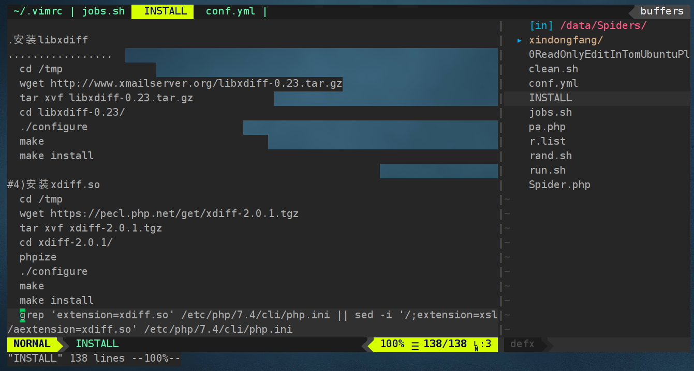

***coc快捷键***
```vim
<space>a     显示错误列表，使用<c-j> 和 <c-k> 上下滚动
<space>o     显示函数和变量列表
<c-d> <-u>   来流动 按K 打开的窗口的 滚动条
```

```vim
:Git log %
:Git add %
:Git commit -m "xxx" %
:Git push 

<F5> \ga  git add
<F6> \gc  git commit
<F7> \gp  git push
     \gl  git log
```

**makrdown**
```vim
\pp   clipboard's image to pic/xxx.png, add 
```

**Key Bindings**
```
" <F2>           Save file
" <F3>           打开关闭DefxTree
" <F4>/<C-c>     关闭buffer
" gt                             切换打开的窗口
" 鼠标双击/<cr>                  打开关闭目录/打开文件
" 鼠标双击/<cr>/<Left>/<Right>   打开关闭目录
"
" h              切换到上一层目录
" D              切换光标下目录为工作区顶级目录
"
" n              创建新文件
" N              创建新目录
" d              删除文件
" r              重命名文件
" m              移动文件
" c              复制文件
" p              粘贴文件
" .              隐藏文件切换
" ~              返回$HOME目录
" <Space>        切换选择与非选择状态
" *              切换所有选择与非选择状态
" j              向下移动光标
" k              向上移动光标
" <c-g>          显示全路径
```
**install vim8.2**
```console
 $ setfacl -R -m d:u:tom:rwx /root
 $ setfacl -R -m u:tom:--- /root/.ssh

 $ apt-get install software-properties-common
 $ add-apt-repository ppa:jonathonf/vim 
 $ apt update
 $ apt upgrade
 $ apt install python3-pip
 $ ln -s /usr/bin/pip3 /usr/bin/pip
 $ pip install pynvim
```

**install and ln nvim to vim**
```console
apt-get install software-properties-common
apt-add-repository ppa:neovim-ppa/stable
apt update
apt install neovim
mkdir ~/.config/nvim
touch ~/.vimrc
ln ~/.vimrc ~/.config/nvim/init.vim

cat >> ~/.bashrc <<EOF
alias vim="/usr/bin/nvim"
alias vi="/usr/bin/nvim"
alias oldvim="/usr/bin/vim"
EOF
. ~/.bashrc
```

**install Plug**
```console
#vim & nvim :
  curl -fLo ~/.vim/autoload/plug.vim --create-dirs https://raw.githubusercontent.com/junegunn/vim-plug/master/plug.vim
  curl -fLo ~/.config/nvim/autoload/plug.vim --create-dirs https://raw.githubusercontent.com/junegunn/vim-plug/master/plug.vim

```

**:CocInstall (after .vimrc & plug coc installed)**
```vim
$ apt install python3 python3-pip python3-venv

$ curl -sL https://deb.nodesource.com/setup_14.x | sudo -E bash -
$ apt install -y nodejs
或
$ wget https://nodejs.org/dist/v14.17.3/node-v14.17.3-linux-x64.tar.xz
$ xz -d node-v14.17.3-linux-x64.tar.xz
$ tar xvf node-v14.17.3-linux-x64.tar
$ mv node-v14.17.3-linux-x64 /opt/node
$ ln -s /opt/node/bin/* /usr/local/bin/

"let g:coc_global_extensions = ['coc-json','coc-css']
"
"一次就成功:
":CocInstall coc-html coc-css coc-json coc-python coc-emmet coc-snippets coc-xml coc-yaml coc-markdownlint 
":CocInstall coc-browser coc-calc coc-eslint coc-explorer coc-flow coc-fzf-preview coc-html-css-support 
":CocInstall coc-lists  coc-snippets  coc-spell-checker  coc-sql coc-sqlfluff coc-sumneko-lua  
":CocInstall coc-tabnine coc-translator coc-tsserver coc-pairs coc-phpls
"
"多次后成功:
":CocInstall coc-git coc-highlight coc-htmlhint coc-markdown-preview-enhanced coc-pydocstring 
":CocInstall coc-sh coc-stylelintplus coc-vimlsp coc-webview  coc-yank
"
"bash
":CocInstall coc-sh
"
"php
":CocInstall coc-phpls
"
"c/c++
"$ apt install clangd
":CocInstall coc-clangd
"
"python
":CocInstall coc-pyright
"
"css
":CocInstall coc-css
"
"js
":CocInstall coc-tsserver

"go
$ apt install golang
$ go env -w GO111MODULE=on
$ go env -w GOPROXY=https://goproxy.cn,direct 
:CocInstall coc-go

"json
:CocInstall coc-json

"snippets
:CocInstall coc-snippets
"
"sed -i 's/^\s\+autocmd CompleteDonePre/"autocmd CompleteDonePre/g' /root/.vim/plugged/vim-vsnip-integ/plugin/vsnip_integ.vim
"
```

**.vimrc**
```vim
set encoding=utf-8
set mouse=a
"折叠处，鼠标双击切换折叠
noremap <2-LeftMouse> za
set hidden

"highlight current line
set cursorline

"""""""""""""""""tab"""""""""""""""""""
"缩进
set cindent smartindent
set tabstop=3 shiftwidth=3 softtabstop=-1

"tab转成空格
set expandtab
:autocmd BufEnter *.*,* retab
"""""""""""""""""~tab"""""""""""""""""""

"diff color
if &diff                                                                                                                                     
     syntax off
endif

"terminal
set splitbelow
nmap t :terminal<CR>
"~terminal

"save
nmap <F2> :w<CR>
imap <F2> <Esc>:w<CR>a

"..........Git key bindings...........
" <F5> \ga  git add
" <F6> \gc  git commit
" <F7> \gp  git push
"      \gl  git log

"nmap <silent> <F5>       :Git add %<CR>
nmap <silent> <Leader>ga :Git add %<CR>

nmap <silent> <F6>       :call MyGitCommit()<CR>
nmap <silent> <Leader>gc :call MyGitCommit()<CR>

nmap <silent> <F7>       :echo 'pushing...'<CR>:Git push<CR>
nmap <silent> <Leader>gp :echo 'pushing...'<CR>:Git push<CR>

nmap <silent> <Leader>gl :Git log %<CR>

function! MyGitCommit()                                                           
  let l:msg = input('Commit Msg: ')                                      
  :execute 'Git commit -m "'.l:msg.'" %'
endfunction                                                                      
"..........~Git key bindings...........

"vim command line press tab completion list
set wildmenu

set cmdheight=2
set updatetime=300
set shortmess+=c

"通过yy复制后，内容vim与系统可共用
set clipboard=unnamedplus,unnamed 

"打开后光标到上次关闭时位置
augroup lastpos
    au!
    au BufReadPost * if line("'\"") > 1 && line("'\"") <= line("$") | exe "normal! g'\"" | endif
augroup END
"~打开后光标到上次关闭时位置

"mkdir -p  ~/.vim/plugin
"cp /usr/share/vim/addons/plugin/matchit.vim ~/.vim/plugin/
let b:match_words='\<if\>:\<elif\>:\<else\>:\<elseif\>:\<fi\>,\<do\>:\<done\>,\<case\>:\<esac\>'

"..................... plugins ......................
"vim& nvim :
"  curl -fLo ~/.vim/autoload/plug.vim --create-dirs https://raw.githubusercontent.com/junegunn/vim-plug/master/plug.vim
"  curl -fLo ~/.config/nvim/autoload/plug.vim --create-dirs https://raw.githubusercontent.com/junegunn/vim-plug/master/plug.vim
call plug#begin('~/.vim/plugged')
  "colorscheme
  "sed -i 's/s:comment_grey = s:colors.comment_grey/s:comment_grey = s:colors.blue_purple/ ~/.vim/plugged/palenight.vim/colors/palenight.vim
  Plug 'drewtempelmeyer/palenight.vim'
  
  "符号自动高亮匹配
  Plug 'luochen1990/rainbow'

  "airline
  Plug 'vim-airline/vim-airline'
  Plug 'vim-airline/vim-airline-themes'
  "~airline
  
  "git
  Plug 'tpope/vim-fugitive'
  Plug 'airblade/vim-gitgutter'
  Plug 'junegunn/gv.vim'
  "~git
  
  Plug 'ap/vim-css-color'
  
  "Plug 'vim-scripts/AutoComplPop'
  Plug 'hrsh7th/vim-vsnip'
  Plug 'hrsh7th/vim-vsnip-integ'
  
  "others
  Plug 'majutsushi/tagbar'
  Plug 'vim-scripts/txt.vim'
  Plug 'mattn/emmet-vim'
  Plug 'stephpy/vim-yaml'
  Plug 'ekalinin/Dockerfile.vim'
  Plug 'othree/html5.vim'
  Plug 'chrisbra/unicode.vim'

  "markdown
  "apt install xclip
  Plug 'godlygeek/tabular'
  Plug 'plasticboy/vim-markdown'
  Plug 'ferrine/md-img-paste.vim'
  "~markdown
 
  "apt install python3-pip; ln -s /usr/bin/pip3 /usr/bin/pip
  "pip install pynvim
  if has('nvim')
      Plug 'Shougo/defx.nvim', { 'do': ':UpdateRemotePlugins' }
  else
      Plug 'Shougo/defx.nvim'
      Plug 'roxma/nvim-yarp'
      Plug 'roxma/vim-hug-neovim-rpc'
      Plug 'kristijanhusak/defx-icons'
      Plug 'kristijanhusak/defx-git'
  endif
 
  Plug 'liuchengxu/vista.vim'  " tagbar 超集替代品
  Plug 'neoclide/coc.nvim', {'branch': 'release'}
call plug#end()


"palenight
colorscheme palenight
"~palenight


"...................coc............................
  inoremap <silent><expr> <TAB>
        \ pumvisible() ? "\<C-n>" :
        \ <SID>check_back_space() ? "\<TAB>" :
        \ coc#refresh()
  inoremap <silent><expr><S-TAB> pumvisible() ? "\<C-p>" : "\<C-h>"
  
  function! s:check_back_space() abort
    let col = col('.') - 1
    return !col || getline('.')[col - 1]  =~# '\s'
  endfunction
  
  " Use <c-space> to trigger completion.
  if has('nvim')
    inoremap <silent><expr> <c-space> coc#refresh()
  else
    inoremap <silent><expr> <c-@> coc#refresh()
  endif
  
  inoremap <silent><expr> <cr> pumvisible() ? coc#_select_confirm()
                                \: "\<C-g>u\<CR>\<c-r>=coc#on_enter()\<CR>"
  
  nmap <silent> [g <Plug>(coc-diagnostic-prev)
  nmap <silent> ]g <Plug>(coc-diagnostic-next)
  
  nmap <silent> gd <Plug>(coc-definition)
  nmap <silent> gy <Plug>(coc-type-definition)
  nmap <silent> gi <Plug>(coc-implementation)
  nmap <silent> gr <Plug>(coc-references)
  
  function! s:show_documentation()
    if (index(['vim','help'], &filetype) >= 0)
      execute 'h '.expand('<cword>')
    elseif (coc#rpc#ready())
      call CocActionAsync('doHover')
    else
      execute '!' . &keywordprg . " " . expand('<cword>')
    endif
  endfunction
  
  nmap <silent> K :call <SID>show_documentation()<CR>
  "autocmd CursorHold *.php,*.py,*.c,*.sh silent call CocActionAsync('doHover')
  
  nmap <leader>rn <Plug>(coc-rename)
  
  xmap <leader>f  <Plug>(coc-format-selected)
  nmap <leader>f  <Plug>(coc-format-selected)
  
  augroup mygroup
    autocmd!
    autocmd FileType typescript,json setl formatexpr=CocAction('formatSelected')
    autocmd User CocJumpPlaceholder call CocActionAsync('showSignatureHelp')
  augroup end
  
  xmap <leader>a  <Plug>(coc-codeaction-selected)
  nmap <leader>a  <Plug>(coc-codeaction-selected)
  
  nmap <leader>ac  <Plug>(coc-codeaction)
  nmap <leader>qf  <Plug>(coc-fix-current)
  
  xmap if <Plug>(coc-funcobj-i)
  omap if <Plug>(coc-funcobj-i)
  xmap af <Plug>(coc-funcobj-a)
  omap af <Plug>(coc-funcobj-a)
  xmap ic <Plug>(coc-classobj-i)
  omap ic <Plug>(coc-classobj-i)
  xmap ac <Plug>(coc-classobj-a)
  omap ac <Plug>(coc-classobj-a)
  
  if has('nvim-0.4.0') || has('patch-8.2.0750')
    nmap <silent><nowait><expr> <C-f> coc#float#has_scroll() ? coc#float#scroll(1) : "\<C-f>"
    nmap <silent><nowait><expr> <C-b> coc#float#has_scroll() ? coc#float#scroll(0) : "\<C-b>"
    inoremap <silent><nowait><expr> <C-f> coc#float#has_scroll() ? "\<c-r>=coc#float#scroll(1)\<cr>" : "\<Right>"
    inoremap <silent><nowait><expr> <C-b> coc#float#has_scroll() ? "\<c-r>=coc#float#scroll(0)\<cr>" : "\<Left>"
    vnoremap <silent><nowait><expr> <C-f> coc#float#has_scroll() ? coc#float#scroll(1) : "\<C-f>"
    vnoremap <silent><nowait><expr> <C-b> coc#float#has_scroll() ? coc#float#scroll(0) : "\<C-b>"
  endif
  
  nmap <silent> <C-s> <Plug>(coc-range-select)
  xmap <silent> <C-s> <Plug>(coc-range-select)
  
  command! -nargs=0 Format :call CocAction('format')
  
  command! -nargs=? Fold :call     CocAction('fold', <f-args>)
  
  command! -nargs=0 OR   :call     CocAction('runCommand', 'editor.action.organizeImport')
  
  set statusline^=%{coc#status()}%{get(b:,'coc_current_function','')}
  set statusline^=%{get(g:,'coc_git_status','')}%{get(b:,'coc_git_status','')}%{get(b:,'coc_git_blame','')}
  
  nmap <silent><nowait> <space>a  :<C-u>CocList diagnostics<cr>
  nmap <silent><nowait> <space>e  :<C-u>CocList extensions<cr>
  nmap <silent><nowait> <space>c  :<C-u>CocList commands<cr>
  nmap <silent><nowait> <space>o  :<C-u>CocList outline<cr>
  nmap <silent><nowait> <space>s  :<C-u>CocList -I symbols<cr>
  nmap <silent><nowait> <space>j  :<C-u>CocNext<CR>
  nmap <silent><nowait> <space>k  :<C-u>CocPrev<CR>
  nmap <silent><nowait> <space>p  :<C-u>CocListResume<CR>

  "scroll popup window
  nmap <expr> <c-d> Misc_popup_scroll_cursor_popup(1) ? '<esc>' : '<c-d>'
  nmap <expr> <c-u> Misc_popup_scroll_cursor_popup(0) ? '<esc>' : '<c-u>'
  
  function! Misc_popup_find_cursor_popup(...)
    let radius = get(a:000, 0, 2)
    let srow = screenrow()
    let scol = screencol()
  
    " it's necessary to test entire rect, as some popup might be quite small
    for r in range(srow - radius, srow + radius)
      for c in range(scol - radius, scol + radius)
        let winid = popup_locate(r, c)
        if winid != 0
          return winid
        endif
      endfor
    endfor
  
    return 0
  endfunction
  
  function! Misc_popup_scroll_cursor_popup(down)
    let winid = Misc_popup_find_cursor_popup()
    if winid == 0
      return 0
    endif
  
    let pp = popup_getpos(winid)
    call popup_setoptions( winid,
          \ {'firstline' : pp.firstline + ( a:down ? 1 : -1 ) } )
  
    return 1
  endfunction  
  "~scroll popup window
"~...................coc............................

"airline
    if !exists('g:airline_symbols')
       let g:airline_symbols = {}
    endif
   
    "unicode symbols
    let g:airline_left_sep = '»'
    let g:airline_left_sep = '▶'
    let g:airline_right_sep = '«'
    let g:airline_right_sep = '◀'
    let g:airline_symbols.crypt = '🔒'
    let g:airline_symbols.linenr = '☰'
    let g:airline_symbols.linenr = '␊'
    let g:airline_symbols.linenr = '␤'
    let g:airline_symbols.linenr = '¶'
    let g:airline_symbols.maxlinenr = ''
    let g:airline_symbols.maxlinenr = '㏑'
    let g:airline_symbols.branch = '⎇'
    let g:airline_symbols.paste = 'ρ'
    let g:airline_symbols.paste = 'Þ'
    let g:airline_symbols.paste = '∥'
    let g:airline_symbols.spell = 'Ꞩ'
    let g:airline_symbols.notexists = 'Ɇ'
    let g:airline_symbols.whitespace = 'Ξ'

  let g:airline#extensions#tabline#enabled = 2
  let g:airline#extensions#tabline#left_sep = ' '
  let g:airline#extensions#tabline#left_alt_sep = '|'
  let g:airline#extensions#tabline#formatter = 'default'
  "let g:airline_powerline_fonts = 1
  let g:airline_theme="dark"
"~airline

"rainbow
let g:rainbow_active = 1
"~rainbow

"gitgutter
"highlight SignColumn guibg=darkgray ctermbg=darkgray

".............. bclose ................
" Load plugin once.
if exists('g:loaded_bclose')
    finish
endif
let g:loaded_bclose = 1

function! s:Warn(msg)
  echohl ErrorMsg
  echomsg a:msg
  echohl NONE
endfunction

function! s:Bclose(bang)
    if(!buflisted(winbufnr(0)))
      bw!
      return
    endif
    let s:bufNum = bufnr("%")
    let s:bufName = bufname("%")
    let s:winNum = winnr()
    if empty(a:bang) && getbufvar(s:bufNum, '&modified')
        call s:Warn('No write since last change for buffer '
                    \ .s:bufName. ' (use :Bclose!)')
        return
    endif
    let prevbufvar = bufnr("#")
    if(prevbufvar > 0 && buflisted(prevbufvar) && prevbufvar != s:bufNum)
        bn
    else
       bn
    endif
    execute s:winNum . 'wincmd w'
    let s:buflistedLeft = 0
    let s:bufFinalJump = 0
    let l:nBufs = bufnr("$")
    let l:i = 1
    if( len(filter(range(1, bufnr('$')), 'buflisted(v:val)')) > 1)
    while(l:i < l:nBufs)
      if(l:i != s:bufNum)
        if(buflisted(l:i))
          let s:buflistedLeft = s:buflistedLeft + 1
        else
          if(bufexists(l:i) && !strlen(bufname(l:i)) && !s:bufFinalJump)
            let s:bufFinalJump = l:i
          endif
        endif
      endif
      let l:i = l:i + 1
    endwhile

    if(!s:buflistedLeft)
      if(s:bufFinalJump)
        windo if(buflisted(winbufnr(0))) | execute "b! " . s:bufFinalJump | endif
      else
        enew
        let l:newBuf = bufnr("%")
        windo if(buflisted(winbufnr(0))) | execute "b! " . l:newBuf | endif
      endif
      execute s:winNum . 'wincmd w'
    endif

    if(buflisted(s:bufNum) || s:bufNum == bufnr("%"))
      execute "bw! " . s:bufNum
    endif

    if(!s:buflistedLeft)
      set buflisted
      set bufhidden=delete
      set buftype=
      setlocal noswapfile
    endif
    endif
endfunction

command! -bang -complete=buffer -nargs=? Bclose call s:Bclose('<bang>')
nnoremap <silent> <Plug>Bclose :<C-u>Bclose<CR>
".............. ~bclose ................

"...............defx...................
" <F3>           打开关闭DefxTree
" <F4>/<C-c>     关闭buffer
" gt                             切换打开的窗口
" 鼠标双击/<cr>                  打开关闭目录/打开文件
" 鼠标双击/<cr>/<Left>/<Right>   打开关闭目录
"
" h              切换到上一层目录
" D              切换光标下目录为工作区顶级目录
"
" n              创建新文件
" N              创建新目录
" d              删除文件
" r              重命名文件
" m              移动文件
" c              复制文件
" p              粘贴文件
" .              隐藏文件切换
" ~              返回$HOME目录
" <Space>        切换选择与非选择状态
" *              切换所有选择与非选择状态
" j              向下移动光标
" k              向上移动光标
" <c-g>          显示全路径

map <C-C> :Bclose<CR>
map <F4>  :Bclose<CR>
map <F3>  :Defx<CR>
autocmd FileType defx call s:defx_my_settings()

function! s:SID_PREFIX() abort
  return matchstr(expand('<sfile>'),
        \ '<SNR>\d\+_\zeSID_PREFIX$')
endfunction
let g:defx_config_sid = s:SID_PREFIX()

call defx#custom#option('_', {
      \ 'winwidth': 20,
      \ 'split': 'vertical',
      \ 'direction': 'topleft',
      \ 'show_ignored_files': 0,
      \ 'buffer_name': 'defxtree',
      \ 'toggle': 1,
      \ 'resume': 1
      \ })

call defx#custom#option('open', {
      \ 'winwidth': 20,
      \ 'split': 'vsplit',
      \ 'direction': 'topleft',
      \ 'show_ignored_files': 0,
      \ 'buffer_name': 'defxtree',
      \ 'toggle': 1,
      \ 'resume': 1
      \ })

call defx#custom#column('icon', {
      \ 'directory_icon': '▸',
      \ 'opened_icon': '▾',
      \ 'root_icon': ' ',
      \ })

call defx#custom#column('filename', {
      \ 'min_width': 40,
      \ 'max_width': 40,
      \ })

call defx#custom#column('mark', {
      \ 'readonly_icon': '✗',
      \ 'selected_icon': '✓',
      \ })


function! s:defx_my_settings() abort
   nmap <silent>               gt      :bn<cr>

   nmap <silent><buffer><expr> h       defx#do_action('call', g:defx_config_sid . 'DefxSmartH')
   nmap <silent><buffer><expr> <Left>  defx#do_action('call', g:defx_config_sid . 'DefxSmartL')

   nmap <silent><buffer><expr> <Right> defx#do_action('call', g:defx_config_sid . 'DefxSmartR')
   nmap <silent><buffer><expr> o       defx#do_action('call', g:defx_config_sid . 'DefxSmartOpen')

   nmap <silent><buffer><expr> <2-LeftMouse> defx#is_directory() ? 
       \ (defx#is_opened_tree() ? defx#do_action('close_tree') : defx#do_action('open_tree') ):
       \ defx#do_action('drop')

   nmap <silent><buffer><expr> <CR>  defx#do_action('call', g:defx_config_sid . 'DefxSmartOpen')
   nmap <silent><buffer><expr> <S-D> defx#do_action('call', g:defx_config_sid . 'DefxSmartChangeDir')

   nmap <silent><buffer><expr> .     defx#do_action('toggle_ignored_files')

   nmap <silent><buffer><expr> n     defx#do_action('new_file')
   nmap <silent><buffer><expr> N     defx#do_action('new_directory')
   nmap <silent><buffer><expr> r     defx#do_action('rename')
   nmap <silent><buffer><expr> d     defx#do_action('remove')

   nmap <silent><buffer><expr> m     defx#do_action('move')
   nmap <silent><buffer><expr> c     defx#do_action('copy')
   nmap <silent><buffer><expr> p     defx#do_action('paste')

   nmap <silent><buffer><expr> ~     defx#do_action('cd')
   nmap <silent><buffer><expr> yy    defx#do_action('yank_path')

   nmap <silent><buffer><expr> j     line('.') == line('$') ? 'gg' : 'j'
   nmap <silent><buffer><expr> k     line('.') == 1 ? 'G' : 'k'

   nmap <silent><buffer><expr> <Space> defx#do_action('toggle_select') . 'j'
   nmap <silent><buffer><expr> *     defx#do_action('toggle_select_all')
   nmap <silent><buffer><expr> <C-g> defx#do_action('print')

   nmap <silent><buffer><expr> s     defx#do_action('toggle_sort', 'time')
   nmap <silent><buffer><expr> E     defx#do_action('open', 'vsplit')
   nmap <silent><buffer><expr> ;     defx#do_action('repeat')
   nmap <silent><buffer><expr> C
     \ defx#do_action('toggle_columns', 'mark:indent:icon:filename:type:size:time')


endfunction
scriptencoding utf-8
 function! s:DefxSmartOpen(_)
   if defx#is_directory()
     call defx#call_action('open_tree')
     normal! j
   else
     let filepath = defx#get_candidate()['action__path']
     if tabpagewinnr(tabpagenr(), '$') >= 3
       if exists(':ChooseWin') == 2
         ChooseWin
       else
         let input = input('ChooseWin No./Cancel(n): ')
         if input ==# 'n' | return | endif
         if input == winnr() | return | endif
         exec input . 'wincmd w'
       endif
       exec 'e' filepath
     else
       exec 'wincmd w'
       exec 'e' filepath
     endif
   endif
 endfunction

 function! s:DefxSmartR(_)
   if defx#is_directory()
     call defx#call_action('open_tree')
     "normal! j
   endif
 endfunction

  function! s:DefxSmartL(_)
   if defx#is_directory()
     call defx#call_action('open_tree')
   endif
 endfunction

 function! s:DefxSmartChangeDir(_)
   let s:candidate = defx#get_candidate()
   let s:parent = fnamemodify(s:candidate['action__path'], s:candidate['is_directory'] ? ':p:h' : ':p:h')
   return defx#call_action('cd', s:parent)
 endfunction

 function! s:DefxSmartH(_)
   if line('.') ==# 1 || line('$') ==# 1
     return defx#call_action('cd', ['..'])
   endif
 
   if defx#is_opened_tree()
     return defx#call_action('close_tree')
   endif
 
   let s:candidate = defx#get_candidate()
   let s:parent = fnamemodify(s:candidate['action__path'], s:candidate['is_directory'] ? ':p:h:h' : ':p:h')
   let sep = '/'
   if s:trim_right(s:parent, sep) == s:trim_right(b:defx.paths[0], sep)
     return defx#call_action('cd', ['..'])
   endif
 
   call defx#call_action('search', s:parent)
 
   call defx#call_action('close_tree')
 endfunction
"...............~defx...................

".........save clipboard's image..........
"\pp to save clipboard's image into pic/xxx.png, and insert
"
let g:mdip_imgdir = 'pic' 
let g:mdip_imgname = 'image'
autocmd FileType markdown nnoremap <silent> <Leader>pp :call mdip#MarkdownClipboardImage()<CR>avatar
".........~save clipboard's image..........
"
"透明
"set statusline=%1*\%<%.50F\             "显示文件名和文件路径 (%<应该可以去掉)
"set statusline+=%=%2*\%y%m%r%h%w\ %*        "显示文件类型及文件状态
"set statusline+=%3*\%{&ff}\[%{&fenc}]\ %*   "显示文件编码类型
"set statusline+=%4*\ row:%l/%L,col:%c\ %*   "显示光标所在行和列
"set statusline+=%5*\%3p%%\%*            "显示光标前文本所占总文本的比例
set cursorline
"hi CursorLine   cterm=none ctermbg=none ctermfg=none
hi User1 cterm=none ctermfg=25 ctermbg=0 
hi User2 cterm=none ctermfg=208 ctermbg=0
hi User3 cterm=none ctermfg=169 ctermbg=0
hi User4 cterm=none ctermfg=100 ctermbg=0
hi User5 cterm=none ctermfg=green ctermbg=0

"hi CursorLine   cterm=none ctermbg=red ctermfg=white
hi Normal  ctermfg=252 ctermbg=none 
set linespace=6

"markdown
let g:vim_markdown_folding_disabled = 1

"latstatus
"set laststatus=1

"F5 执行
map <F5> :call CompileRunGcc()<CR>
func! CompileRunGcc()
	exec "w"
	if &filetype == 'c'
		exec "!g++ % -o %<"
		exec "!time ./%<"
	elseif &filetype == 'cpp'
		exec "!g++ % -o %<"
		exec "!time ./%<"
	elseif &filetype == 'java' 
		exec "!javac %" 
		exec "!time java %<"
	elseif &filetype == 'sh'
		:!time bash %
	elseif &filetype == 'python'
		exec "!time python3 %"
	elseif &filetype == 'html'
		exec "!firefox % &"
	elseif &filetype == 'go'
		exec "!go build %<"
		exec "!time go run %"
	elseif &filetype == 'mkd'
		exec "!~/.vim/markdown.pl % > %.html &"
		exec "!firefox %.html &"
	endif
endfunc 
"~F5 执行
```

"!!!这个很重要，效果很清新
hi CursorLine ctermbg=230
