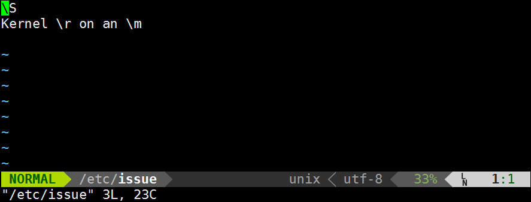

**install powerline_fonts**
```bash
git clone https://github.com/powerline/fonts.git --depth=1
cd fonts
./install.sh  
./install.sh  安装两次来确认
```

**install airline**
```vim
"airline
call plug#begin('~/.vim/plugged')
   Plug 'vim-airline/vim-airline'
   Plug 'vim-airline/vim-airline-themes'
call plug#end()

let g:airline#extensions#tabline#enabled = 2
let g:airline#extensions#tabline#left_sep = ' '
let g:airline#extensions#tabline#left_alt_sep = '|'
let g:airline#extensions#tabline#formatter = 'default'
let g:airline_powerline_fonts = 1  

let g:airline_theme="dark"

"~airline
```

**~/.vim/bashrc**
```bash
"   export TERM=xterm-<t_co>color
" grep '.vim/bashrc' ~/.bashrc || echo source ~/.vim/bashrc >> ~/.bashrc
```


