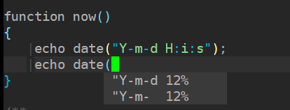

**install**
```vim
 Plug 'codota/tabnine-vim'
```

```bash
.install golang
 $ apt update
 $ wget https://golang.google.cn/dl/go1.15.8.linux-amd64.tar.g 
 $ tar -C /usr/local/ -xvf go1.15.8.linux-amd64.tar.gz 
 $ grep -R 'GOPATH' /etc/profile || echo -e 'export GOPATH=/root/go\nexport PATH=$PATH:/usr/local/go/bin:$GOPATH/bin' >> /etc/profile
 $ . /etc/profile
 
 $ go get -u github.com/sourcegraph/go-langserver
 $ go get -u golang.org/x/tools/gopls 
```

**config**
```vim
  无需配置
```

**usage**
```vim
  自动提示函数参数提示
```


